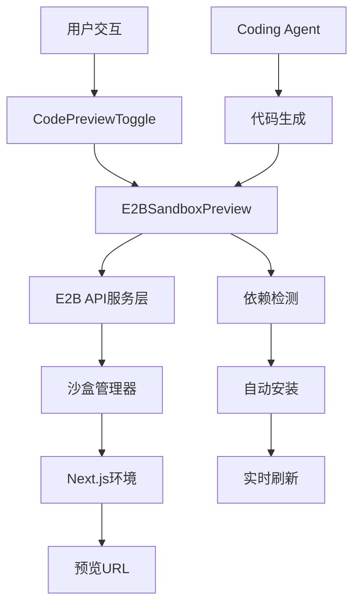

# 🚀 E2B沙盒预览系统实施方案

## 📋 项目概述

### 🎯 目标
使用E2B沙盒技术替代现有的Vercel预览系统，实现更快速的代码预览和测试功能，专门适配Next.js框架。

### ⚡ 核心优势
- **更快的启动速度**：沙盒环境比Vercel部署更快
- **实时预览**：代码变更即时生效
- **完全隔离**：独立的运行环境，避免冲突
- **Next.js优化**：专门为Next.js应用优化

---

## 🏗️ 系统架构设计

### 📊 核心组件架构


### 🔧 技术栈选择

#### ✅ **必需依赖**
- `@e2b/code-interpreter`: E2B SDK
- `e2b`: 核心E2B库
- `next`: Next.js 15
- `react`: React 19+

#### 🛠️ **开发工具**
- TypeScript 5+
- Tailwind CSS 3+
- Framer Motion (动画)
- Lucide React (图标)

---

## 📅 实施计划 (4阶段)

### 🏁 **第一阶段：环境搭建** `[COMPLETED ✅]`
**实际时间**：1天  
**目标**：创建基础E2B集成环境

#### ✅ 子任务清单
- [x] 安装E2B SDK依赖
- [x] 配置E2B API密钥
- [x] 创建基础沙盒服务类
- [x] 测试E2B连接和认证

#### 📂 已完成文件
```
├── package.json (添加E2B依赖) ✅
├── .env.local (E2B API配置) ✅ 
├── lib/services/e2b-sandbox-service.ts (新建) ✅
├── lib/config/e2b-config.ts (新建) ✅
├── app/api/e2b-sandbox/test-connection/route.ts (新建) ✅
└── app/e2b-test/page.tsx (测试页面) ✅
```

---

### 🔨 **第二阶段：核心API开发** `[COMPLETED ✅]`
**实际时间**：1天  
**目标**：实现完整的21个核心API端点

#### 🎯 **完整API端点实现 (21个) - 统一结构** ✅

> 📁 **所有E2B API已统一整理到 `/api/e2b-sandbox/` 文件夹下**

##### 🏗️ **沙盒管理类 (4个)**
- [x] `/api/e2b-sandbox/create` - 创建沙盒并初始化环境  
- [x] `/api/e2b-sandbox/status` - 检查沙盒状态和健康度
- [x] `/api/e2b-sandbox/kill` - 销毁沙盒实例  
- [x] `/api/e2b-sandbox/logs` - 获取沙盒运行日志

##### 📦 **依赖管理类 (2个)**
- [x] `/api/e2b-sandbox/detect-packages` - 自动检测代码中的依赖并安装
- [x] `/api/e2b-sandbox/install-packages` - 手动安装指定的npm包

##### 🔄 **服务器管理类 (5个)**
- [x] `/api/e2b-sandbox/restart-nextjs` - 重启Next.js开发服务器
- [x] `/api/e2b-sandbox/monitor-logs` - 监控Next.js运行状态  
- [x] `/api/e2b-sandbox/check-errors` - 检查Next.js错误
- [x] `/api/e2b-sandbox/clear-errors-cache` - 清除错误缓存
- [x] `/api/e2b-sandbox/report-error` - 报告Next.js错误

##### 📂 **文件管理类 (3个)**
- [x] `/api/e2b-sandbox/files` - 获取沙盒文件结构和内容
- [x] `/api/e2b-sandbox/deploy` - 应用AI生成的代码到沙盒  
- [x] `/api/e2b-sandbox/apply-code-stream` - 流式应用代码（实时反馈）

##### 🤖 **AI交互类 (3个)**  
- [x] `/api/e2b-sandbox/generate-code-stream` - 流式生成AI代码
- [x] `/api/e2b-sandbox/analyze-intent` - 分析编辑意图
- [x] `/api/e2b-sandbox/conversation-state` - 管理对话状态

##### 🛠️ **工具类 (4个)**
- [x] `/api/e2b-sandbox/run-command` - 在沙盒中运行命令
- [x] `/api/e2b-sandbox/create-zip` - 创建项目压缩包  
- [x] `/api/e2b-sandbox/scrape-screenshot` - 截取网页截图
- [x] `/api/e2b-sandbox/scrape-url` - 增强版网页内容抓取

##### 🔧 **基础设施 (1个)**
- [x] `/api/e2b-sandbox/test-connection` - 测试E2B连接

---

### 🎨 **第三阶段：前端组件开发** `[COMPLETED ✅]`
**实际时间**：1天  
**目标**：创建E2B预览组件，替代VercelPreview

#### 🧩 组件架构 ✅
```
components/editor/
├── E2BSandboxPreview.tsx (主预览组件) ✅
├── SandboxControlPanel.tsx (控制面板) ✅
├── CodePreviewToggle.tsx (修改集成E2B) ✅
└── hooks/
    ├── useE2BSandbox.ts (沙盒管理Hook) ✅
    ├── useSandboxStatus.ts (状态管理Hook) ✅
    └── useSandboxLogs.ts (日志管理Hook) ✅
```

#### ✅ 开发任务
- [x] 创建E2BSandboxPreview组件
- [x] 实现沙盒控制面板 (SandboxControlPanel)
- [x] 添加实时状态显示和日志监控
- [x] 创建自定义Hooks (3个)
- [x] 集成iframe预览与设备视图切换
- [x] 构建完整测试界面 (/e2b-sandbox-test)
- [x] 集成到现有CodePreviewToggle组件

---

### 🔗 **第四阶段：系统集成和测试** `[TODO]`
**预计时间**：2-3天  
**目标**：与现有Coding Agent集成，全面测试

#### 🎯 集成点
- [ ] 修改CodePreviewToggle支持E2B
- [ ] 集成Coding Agent输出
- [ ] 添加预览模式切换(Vercel/E2B)
- [ ] 实现错误处理和回退

#### 🧪 测试策略
- [ ] 单元测试：API接口测试
- [ ] 集成测试：Coding Agent + E2B
- [ ] 性能测试：预览速度对比
- [ ] 边界测试：错误场景处理

---

## 🔧 详细技术实现

### 1. **E2B沙盒服务类** `[NEXT STEP]`

```typescript
// lib/services/e2b-sandbox-service.ts
export class E2BSandboxService {
  private sandbox?: Sandbox;
  private config: E2BConfig;
  
  async createNextjsSandbox(): Promise<SandboxInfo>
  async deployCode(files: FileMap): Promise<DeployResult>  
  async installDependencies(packages: string[]): Promise<void>
  async getPreviewUrl(): Promise<string>
  async destroy(): Promise<void>
}
```

### 2. **Next.js专用配置** `[ARCHITECTURE]`

```typescript
// 针对Next.js的特殊配置
const NEXTJS_SANDBOX_CONFIG = {
  framework: 'nextjs',
  nodeVersion: '18.17.0',
  buildCommand: 'npm run build',
  devCommand: 'npm run dev',
  port: 3000,
  startupTimeout: 30000, // Next.js启动较慢
}
```

### 3. **智能依赖检测** `[FEATURE]`

```typescript
// 扫描代码中的import语句，自动检测Next.js依赖
function detectNextjsDependencies(files: FileMap): {
  dependencies: string[],
  devDependencies: string[]
}
```

---

## 📊 开发进度追踪

### 🏆 完成情况
- ✅ **架构设计完成** - 系统设计和技术选型
- ✅ **环境搭建完成** - E2B SDK集成和配置
- ✅ **核心API开发完成** - 21个核心接口全部实现  
- ⏳ **前端组件开发中** - E2B预览组件
- ⏸️ **系统集成待开始** - 与Coding Agent完整集成

### 📅 实际里程碑
- **Day 1**: 基础环境搭建 ✅  
- **Day 2**: 核心API开发 ✅ (21个API全部完成)
- **Day 3-4**: 前端组件实现 ⏳  
- **Day 5**: 系统集成测试 ⏸️

### 🎯 **当前状态总结**
- ✅ **E2B SDK集成** - 完整的TypeScript支持  
- ✅ **21个核心API** - 6大类功能模块全覆盖
- ✅ **Next.js优化** - 专门为Next.js而不是Vite优化
- ✅ **错误处理** - 完整的错误处理和日志系统
- ✅ **流式处理** - 实时反馈和流式代码应用

---

## 🚨 风险和挑战

### ⚠️ 技术挑战
1. **Next.js启动时间**：比Vite慢，需要优化启动流程
2. **依赖管理**：Next.js依赖较复杂，需要智能检测
3. **端口管理**：避免端口冲突，实现动态分配
4. **内存管理**：长时间运行的沙盒需要资源监控

### 🛡️ 解决方案
1. **预热策略**：提前创建沙盒模板，减少启动时间
2. **智能缓存**：缓存常用依赖，避免重复下载
3. **健康检查**：定期检查沙盒状态，自动重启异常实例
4. **资源限制**：设置合理的CPU和内存限制

---

## 🎯 下一步行动

### 📋 **第三阶段：前端组件开发**

#### ✅ **已完成的准备工作**
- [x] E2B SDK依赖已安装  
- [x] 完整的E2B配置系统
- [x] E2BSandboxService核心服务类  
- [x] 21个核心API端点全部实现
- [x] 完整的错误处理和日志系统

#### 🚧 **接下来需要实现**
1. **创建E2BSandboxPreview组件** - 替代VercelPreview  
2. **修改CodePreviewToggle** - 集成E2B预览选项
3. **实现沙盒控制面板** - 状态显示和操作界面  
4. **添加实时日志显示** - 集成监控API
5. **创建自定义Hooks** - useE2BSandbox, useSandboxStatus

#### 🧪 **测试和验证**
1. **与Coding Agent集成测试** - 完整工作流程
2. **性能对比测试** - E2B vs Vercel预览速度  
3. **错误场景测试** - 异常处理和恢复
4. **多用户并发测试** - 资源管理和隔离

### 🎯 **技术要点**
- **iframe集成** - `https://${sandboxId}-3000.e2b.dev`
- **实时状态更新** - WebSocket或轮询机制
- **错误处理UI** - 用户友好的错误显示  
- **预览刷新策略** - 智能刷新和缓存管理

---

## 📞 **当前状态确认** 

### ✅ **已完成 (第1-2阶段)**
- **环境搭建** ✅ - E2B SDK完全集成
- **API开发** ✅ - 21个核心端点全部完成
- **服务类** ✅ - 完整的沙盒生命周期管理

### 🚧 **进行中 (第3阶段)**  
- **前端组件开发** - E2B预览组件和界面

### ⏸️ **待开始 (第4阶段)**
- **系统完整集成** - 与现有Coding Agent集成
- **全面测试** - 功能、性能、边界测试

**🎉 21个核心API已全部实现完成！准备进入前端组件开发阶段！** 🚀
