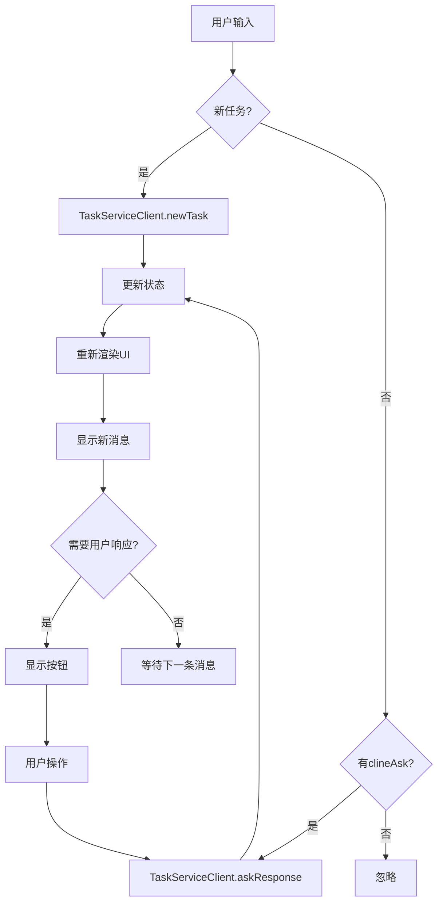

# Cline对话架构深度分析

## 🎯 核心发现

经过深入分析Cline的源码，我发现其对话架构设计有以下突出特点：

### 1. **模块化架构设计**

```typescript
// 核心架构图
ExtensionStateContext (全局状态)
├── ChatView (主视图容器)
│   ├── TaskSection (任务区域)
│   ├── MessagesArea (消息区域)
│   │   └── ChatRow (单条消息)
│   └── InputSection (输入区域)
├── Custom Hooks (状态管理)
│   ├── useChatState
│   ├── useMessageHandlers
│   ├── useButtonState
│   └── useScrollBehavior
└── Services (服务层)
    ├── StateServiceClient
    ├── TaskServiceClient
    └── UiServiceClient
```

### 2. **状态管理策略**

#### A. 全局状态 (ExtensionStateContext)
```typescript
interface ExtensionState {
  clineMessages: ClineMessage[];     // 消息数组
  taskHistory: HistoryItem[];        // 任务历史
  apiConfiguration: ApiConfiguration; // API配置
  showSettings: boolean;             // 视图状态
  showHistory: boolean;
  // ... 其他状态
}
```

#### B. 聊天状态 (useChatState)
```typescript
interface ChatState {
  // 输入状态
  inputValue: string;
  selectedImages: string[];
  selectedFiles: string[];
  activeQuote: string | null;
  
  // UI状态
  enableButtons: boolean;
  primaryButtonText: string;
  secondaryButtonText: string;
  expandedRows: Record<number, boolean>;
  
  // 派生状态
  lastMessage: ClineMessage;
  clineAsk: ClineAsk;
}
```

### 3. **消息处理机制**

#### A. 消息类型系统
```typescript
type ClineMessage = {
  type: 'ask' | 'say';
  ask?: ClineAsk;                    // 询问类型
  say?: ClineSay;                    // 说明类型
  text?: string;                     // 消息内容
  images?: string[];                 // 图片附件
  files?: string[];                  // 文件附件
  ts: number;                        // 时间戳
}

type ClineAsk = 
  | 'followup'                       // 后续问题
  | 'command'                        // 命令确认
  | 'tool'                          // 工具调用
  | 'completion_result'             // 完成结果
  | 'api_req_failed'                // API请求失败
  // ... 更多类型
```

#### B. 消息处理流程
```typescript
// 1. 接收消息
handleSendMessage(text, images, files) {
  if (messages.length === 0) {
    // 新任务
    await TaskServiceClient.newTask({text, images, files});
  } else if (clineAsk) {
    // 响应询问
    await TaskServiceClient.askResponse({
      responseType: 'messageResponse',
      text, images, files
    });
  }
}

// 2. 处理不同类型的询问
handlePrimaryButtonClick() {
  switch (clineAsk) {
    case 'command':
    case 'tool':
      await TaskServiceClient.askResponse({
        responseType: 'yesButtonClicked'
      });
      break;
    case 'completion_result':
      startNewTask();
      break;
  }
}
```

### 4. **UI交互模式**

#### A. 消息渲染逻辑
```typescript
// ChatRow组件根据消息类型渲染不同内容
const ChatRow = ({ message }) => {
  switch (message.type) {
    case 'ask':
      return <AskMessage ask={message.ask} />;
    case 'say':
      switch (message.say) {
        case 'api_req_started':
          return <ApiRequestMessage />;
        case 'tool':
          return <ToolMessage />;
        case 'command_output':
          return <CommandOutputMessage />;
      }
  }
}
```

#### B. 动态按钮系统
```typescript
const useButtonState = (messages, chatState) => {
  useEffect(() => {
    const { clineAsk } = chatState;
    
    switch (clineAsk) {
      case 'command':
        setPrimaryButtonText('Approve');
        setSecondaryButtonText('Reject');
        break;
      case 'tool':
        setPrimaryButtonText('Allow');
        setSecondaryButtonText('Deny');
        break;
      case 'completion_result':
        setPrimaryButtonText('Start New Task');
        setSecondaryButtonText(undefined);
        break;
    }
  }, [clineAsk]);
}
```

### 5. **关键设计原则**

1. **单一数据源**: 所有状态都通过ExtensionStateContext管理
2. **类型驱动**: 基于消息类型决定UI渲染和交互
3. **钩子分离**: 将不同职责的逻辑分离到专门的hooks中
4. **组件化**: 每个UI部分都是独立的组件
5. **响应式**: 状态变化自动触发UI更新

### 6. **可扩展性设计**

#### A. 新消息类型
```typescript
// 添加新的ask类型
type ClineAsk = 
  | 'existing_types'
  | 'new_custom_ask';  // 新增类型

// 对应的处理逻辑
const handleNewCustomAsk = () => {
  // 处理新类型的逻辑
}
```

#### B. 新UI组件
```typescript
// 新组件自动集成到现有架构
const NewMessageType = ({ message }) => {
  return <div>New message type rendering</div>;
}

// 在ChatRow中添加
case 'new_message_type':
  return <NewMessageType message={message} />;
```

## 🎨 UI交互特点

### 1. **消息布局**
- 用户消息右对齐，浅色背景
- 助手消息左对齐，深色背景
- 系统消息居中，特殊样式

### 2. **工具调用显示**
- 工具名称和参数清晰显示
- 执行状态实时更新
- 结果支持展开/收缩

### 3. **按钮状态**
- 根据context动态显示
- 支持带输入的确认
- 视觉反馈清晰

### 4. **代码块处理**
- 语法高亮
- 复制功能
- 文件路径显示

## 🔄 消息流程



## 📊 性能优化

### 1. **虚拟滚动**
```typescript
// 使用react-virtuoso处理大量消息
<Virtuoso
  data={visibleMessages}
  itemContent={(index, message) => (
    <ChatRow 
      message={message} 
      index={index}
    />
  )}
/>
```

### 2. **消息过滤**
```typescript
// 只渲染可见消息
const visibleMessages = useMemo(() => 
  messages.filter(message => shouldShowMessage(message)),
  [messages]
);
```

### 3. **状态优化**
```typescript
// 使用React.memo减少重渲染
const ChatRow = memo(({ message }) => {
  // 组件内容
}, deepEqual);
```

## 🔧 服务层设计

### 1. **gRPC客户端**
```typescript
// 统一的服务接口
export const TaskServiceClient = {
  newTask: (request) => grpcClient.call('newTask', request),
  askResponse: (request) => grpcClient.call('askResponse', request),
  clearTask: (request) => grpcClient.call('clearTask', request),
}
```

### 2. **状态同步**
```typescript
// 自动同步状态
useEffect(() => {
  const subscription = StateServiceClient.subscribeToState();
  subscription.on('stateUpdate', (newState) => {
    setState(newState);
  });
  return () => subscription.unsubscribe();
}, []);
```

## 🎯 总结

Cline的对话架构设计精妙，具有以下优势：

1. **清晰的层次结构**: 状态、视图、逻辑分离
2. **强类型系统**: 基于TypeScript的类型安全
3. **模块化设计**: 易于扩展和维护  
4. **响应式更新**: 状态变化自动反映到UI
5. **性能优化**: 虚拟滚动和智能渲染

这种架构设计不仅支持当前的功能需求，还为未来的扩展提供了良好的基础。 