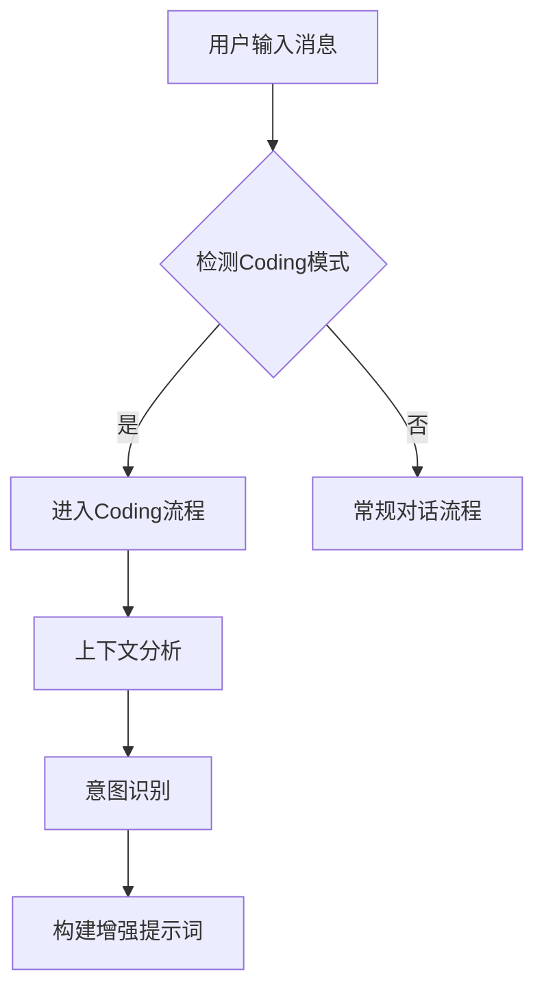
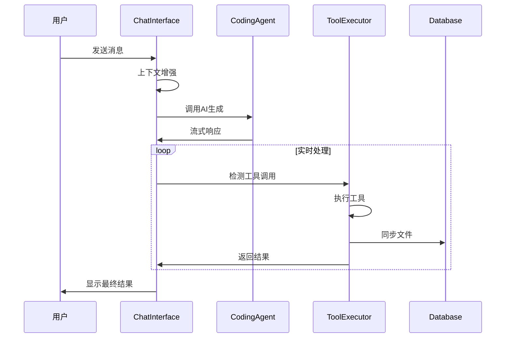
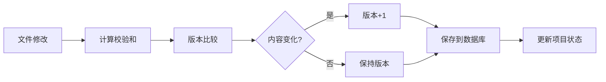
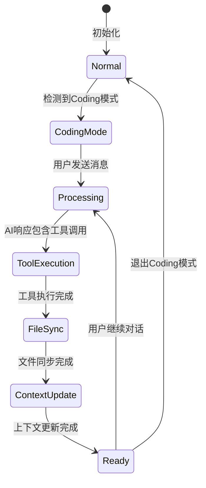

# Coding 模式工作流程与对话流转逻辑

## 📋 概述

本文档详细描述了HeysMe平台中AI Coding模式的完整工作流程，包括用户交互、系统处理、代码生成、文件管理和数据持久化的全流程。

## 🎯 系统架构

```
┌─────────────────┐    ┌─────────────────┐    ┌─────────────────┐
│   用户界面层     │    │   智能处理层     │    │   数据存储层     │
├─────────────────┤    ├─────────────────┤    ├─────────────────┤
│ ChatInterface   │    │ CodingAgent     │    │ CodingDatabase  │
│ CodingModeUI    │    │ ToolExecutor    │    │ SessionStorage  │
│ ProjectStatus   │    │ ContextManager  │    │ FileStorage     │
└─────────────────┘    └─────────────────┘    └─────────────────┘
```

## 🔄 完整工作流程

### 1. 用户输入阶段



#### 1.1 输入检测
- **触发条件**: 
  - `sessionStatus.currentStage === 'coding'`
  - `sessionStatus.metadata.mode === 'coding'`
  - `sessionStatus.metadata.agent_name === 'CodingAgent'`

#### 1.2 用户消息示例
```javascript
// 原始用户输入
"请帮我创建一个登录页面"

// 系统处理
- 模式检测: ✅ Coding模式
- 意图识别: "用户想要创建新功能"
- 上下文获取: 当前项目文件、框架、依赖
```

### 2. 上下文增强阶段

#### 2.1 项目上下文分析
```typescript
interface CodingContext {
  currentFiles: CodeFile[];           // 当前项目文件
  projectStructure: string;          // 项目目录结构
  lastModifiedFiles: string[];       // 最近修改文件
  activeFeature: string;             // 正在开发的功能
  dependencies: Record<string, string>; // 项目依赖
  projectType: string;               // 项目类型
  framework: string;                 // 使用框架
  userIntent: string;                // 用户意图
  conversationHistory: string[];     // 对话历史
}
```

#### 2.2 智能分析过程
```javascript
// 1. 分析项目类型
const analyzeProject = (files) => {
  // 检测package.json
  // 分析文件扩展名
  // 识别框架和技术栈
  return { projectType, framework, dependencies };
};

// 2. 识别用户意图
const analyzeUserIntent = (messages) => {
  // 关键词分析
  if (message.includes('创建')) return '用户想要创建新功能';
  if (message.includes('修改')) return '用户想要修改现有功能';
  // ...
};

// 3. 构建增强提示词
const buildContextualPrompt = (userInput) => {
  return `
  ## 当前项目情况
  **项目类型**: ${projectType}
  **使用框架**: ${framework}
  **文件数量**: ${fileCount}
  **用户意图**: ${userIntent}
  
  ### 项目结构:
  ${projectStructure}
  
  **用户新请求**: ${userInput}
  `;
};
```

### 3. AI处理阶段

#### 3.1 流式响应处理


#### 3.2 工具调用检测
```typescript
// AI响应中的工具调用格式
const toolPattern = `
<write_to_file>
<path>components/LoginForm.tsx</path>
<content>
import React from 'react';

export function LoginForm() {
  return (
    <div>登录表单</div>
  );
}
</content>
</write_to_file>
`;

// 系统自动检测和执行
const processStreamChunk = (accumulatedText) => {
  const blocks = parser.parseStreamingContent(accumulatedText);
  blocks.forEach(block => {
    if (block.type === 'tool_use') {
      executeActualTool(block.toolName, block.toolParams);
    }
  });
};
```

### 4. 工具执行阶段

#### 4.1 支持的工具类型
```typescript
interface ToolMap {
  'write_to_file': {
    params: { path: string; content: string; }
    action: '创建或更新文件'
    userMessage: '✅ 已为您创建了一个新文件: {path}'
  },
  'read_file': {
    params: { path: string; }
    action: '读取文件内容'
    userMessage: '📖 这是 {path} 文件的内容'
  },
  'execute_command': {
    params: { command: string; }
    action: '执行命令操作'
    userMessage: '⚡ 已为您执行了所需的操作'
  },
  'list_files': {
    params: {}
    action: '列出项目文件'
    userMessage: '📁 您目前有以下文件'
  }
}
```

#### 4.2 工具执行流程
```javascript
const executeActualTool = async (toolName, params) => {
  try {
    // 1. 添加执行状态消息
    const toolMessage = {
      content: getToolFriendlyMessage(toolName),
      metadata: { toolExecution: true, status: 'executing' }
    };
    setMessages(prev => [...prev, toolMessage]);

    // 2. 执行具体工具
    switch (toolName) {
      case 'write_to_file':
        // 更新本地文件状态
        setCodeFiles(prev => updateFiles(prev, params));
        // 自动更新上下文
        updateCodingContext(updatedFiles);
        // 同步到数据库
        await syncFileToDatabase(fileData);
        break;
      // 其他工具...
    }

    // 3. 更新执行结果
    updateToolMessage(toolMessage.id, 'completed', result);
    
  } catch (error) {
    updateToolMessage(toolMessage.id, 'error', errorMessage);
  }
};
```

### 5. 数据同步阶段

#### 5.1 文件持久化流程


#### 5.2 数据库同步API
```typescript
// API端点: /api/coding-agent/sync-file
POST /api/coding-agent/sync-file
{
  "sessionId": "session_123",
  "file": {
    "path": "components/LoginForm.tsx",
    "content": "...",
    "language": "typescript",
    "timestamp": "2024-01-01T00:00:00Z"
  }
}

// 响应
{
  "success": true,
  "file": {
    "id": "file_456",
    "version": 2,
    "checksum": "abc123",
    "status": "synced"
  }
}
```

### 6. 用户反馈阶段

#### 6.1 实时状态显示
```typescript
// 状态指示器组件
const CodingStatusIndicator = () => {
  if (isStreaming) return "正在为您创建文件...";
  if (activeTools.length > 0) return "正在处理您的请求";
  if (codingAgentError) return "处理中遇到问题";
  return "AI 助手已准备好";
};

// 项目状态面板
const ProjectStatusPanel = () => {
  return (
    <Card>
      <CardContent>
        <div>文件数量: {fileCount}</div>
        <div>项目类型: {projectType}</div>
        <div>当前任务: {getIntentDisplay(userIntent)}</div>
        <div>最近文件: {lastModifiedFiles}</div>
      </CardContent>
    </Card>
  );
};
```

#### 6.2 用户友好消息转换
```typescript
const getToolFriendlyMessage = (toolName) => {
  const messageMap = {
    'write_to_file': '💾 正在为您创建文件...',
    'read_file': '📖 正在读取文件...',
    'execute_command': '⚡ 正在执行操作...',
    'list_files': '📁 正在查看文件列表...'
  };
  return messageMap[toolName] || '🔄 正在处理您的请求...';
};
```

## 🎯 关键流程节点

### 节点1: 模式检测
```javascript
// 触发条件检查
const shouldEnableCodingMode = 
  sessionStatus?.currentStage === 'coding' || 
  sessionStatus?.metadata?.mode === 'coding' ||
  sessionStatus?.metadata?.agent_name === 'CodingAgent';

if (shouldEnableCodingMode !== isCodingMode) {
  setIsCodingMode(shouldEnableCodingMode);
  initializeToolExecutor();
}
```

### 节点2: 上下文增强
```javascript
const sendMessage = async (message) => {
  let enhancedMessage = message;
  
  if (isCodingMode && message.trim()) {
    // 构建增强提示词
    enhancedMessage = buildContextualPrompt(message);
    
    // 更新用户意图
    setCodingContext(prev => ({
      ...prev,
      userIntent: analyzeUserIntent([{content: message, type: 'user_message'}]),
      conversationHistory: [...(prev.conversationHistory || []), message].slice(-10)
    }));
  }
  
  // 发送增强后的消息到AI
  await sendToAI(enhancedMessage);
};
```

### 节点3: 工具执行
```javascript
const toolExecutor = new StreamingToolExecutor({
  onToolExecute: async (toolName, params) => {
    // 显示执行状态
    setActiveTools(prev => [...prev, toolName]);
    addToolExecutionMessage(toolName, 'executing');
    
    try {
      // 执行工具
      const result = await executeActualTool(toolName, params);
      
      // 更新状态
      updateToolExecutionMessage(toolName, 'completed', result);
      
      return result;
    } catch (error) {
      updateToolExecutionMessage(toolName, 'error', error.message);
      throw error;
    } finally {
      setActiveTools(prev => prev.filter(t => t !== toolName));
    }
  }
});
```

### 节点4: 文件同步
```javascript
const syncFileToDatabase = async (file) => {
  const response = await fetch('/api/coding-agent/sync-file', {
    method: 'POST',
    headers: { 'Content-Type': 'application/json' },
    body: JSON.stringify({
      sessionId,
      file: {
        path: file.path,
        content: file.content,
        language: file.language,
        timestamp: new Date().toISOString()
      }
    })
  });
  
  if (!response.ok) {
    throw new Error(`同步失败: ${response.status}`);
  }
  
  return await response.json();
};
```

## 📊 状态管理

### 全局状态
```typescript
interface ChatInterfaceState {
  // 基础状态
  isCodingMode: boolean;
  isStreaming: boolean;
  messages: ConversationEntry[];
  
  // Coding专用状态
  toolExecutor: StreamingToolExecutor | null;
  activeTools: string[];
  codeFiles: CodeFile[];
  codingAgentError: string | null;
  
  // 上下文管理
  codingContext: CodingContext;
  accumulatedAIResponse: string;
}
```

### 状态流转


## 🔍 错误处理

### 错误类型与处理
```typescript
interface ErrorHandling {
  'tool_execution_error': {
    display: '😔 抱歉，处理过程中遇到了一些问题，请稍后重试';
    action: 'retry';
    fallback: 'continue_conversation';
  },
  'file_sync_error': {
    display: '文件保存失败，但您的更改已在本地保存';
    action: 'background_retry';
    fallback: 'local_storage';
  },
  'context_analysis_error': {
    display: '正在分析项目结构...';
    action: 'silent_fallback';
    fallback: 'basic_mode';
  }
}
```

## 📈 性能优化

### 关键优化点
1. **并行处理**: 文件操作与数据库同步并行进行
2. **增量更新**: 只同步变更的文件部分
3. **上下文缓存**: 项目分析结果缓存复用
4. **流式响应**: 用户实时看到处理进度

### 优化措施
```typescript
// 防抖处理
const debouncedContextUpdate = useCallback(
  debounce(updateCodingContext, 500),
  []
);

// 并行同步
const parallelSync = async (files) => {
  const syncPromises = files.map(file => syncFileToDatabase(file));
  await Promise.allSettled(syncPromises);
};

// 增量分析
const incrementalAnalysis = (newFiles, previousContext) => {
  if (filesUnchanged(newFiles, previousContext.currentFiles)) {
    return previousContext; // 复用缓存
  }
  return analyzeProject(newFiles); // 重新分析
};
```

## 🎉 用户体验

### 用户看到的完整流程
```
1. 用户: "请帮我创建一个登录页面"
   
2. 系统: 🎯 理解您想要创建新功能
   
3. 系统: 💾 正在为您创建文件...
   
4. 系统: ✅ 已为您创建了一个新文件: components/LoginForm.tsx
   
5. 系统: 📁 您目前有以下文件:
   - components/LoginForm.tsx
   - styles/login.css
   - pages/login.tsx
   
6. 系统: 🎨 登录页面已创建完成！包含表单验证和响应式设计
```

### 状态面板显示
```
┌─────────────────────────────────┐
│ ✨ 项目助手                      │
├─────────────────────────────────┤
│ 🎯 项目已准备好，请告诉我您想要  │
│    添加什么功能                  │
│                                 │
│ 📊 项目统计                     │
│ 文件数量: 8                     │
│ 项目类型: 网页应用              │
│ 使用技术: React + TypeScript    │
│                                 │
│ 🎯 当前任务                     │
│ 🎯 准备添加新功能                │
│                                 │
│ 📝 最近处理的文件               │
│ • components/LoginForm.tsx      │
│ • styles/login.css              │
│ • pages/login.tsx               │
└─────────────────────────────────┘
```

---

## 🔧 技术实现要点

1. **模块化设计**: 每个功能模块独立，便于维护
2. **类型安全**: 完整的TypeScript类型定义
3. **用户友好**: 隐藏技术细节，使用自然语言
4. **实时反馈**: 所有操作都有即时状态显示
5. **容错处理**: 优雅的错误处理和重试机制

这套流程确保了用户可以通过自然语言与AI对话，自动生成高质量的代码，同时保持所有数据的安全性和一致性。 