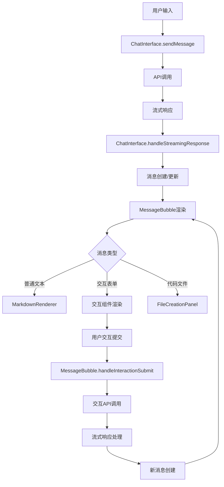

# 🎯 组件职责分工明细

## 📋 **ChatInterface vs MessageBubble 职责划分**

### 🏗️ **ChatInterface 职责范围**

#### 【核心职责】
1. **全局状态管理**
   - 会话状态 (sessionId, sessionStatus)
   - 认证状态 (isAuthenticated, authLoading)
   - 模式切换 (isCodingMode, 普通模式)
   - 消息列表管理 (messages)

2. **流式数据接收和分发**
   - SSE流数据接收 (`/api/chat/stream`, `/api/coding-agent`)
   - 流式响应解析 (`handleStreamingResponse`)
   - 消息创建和更新分发
   - 数据流结束处理

3. **系统级Loading状态**
   - 轮播Loading (`LoadingCarousel`)
   - 全局等待状态 (`systemLoadingState`)
   - 思考状态 (用户输入后等待AI响应)
   - 系统级错误提示

4. **工具执行状态管理**
   - 活跃工具列表 (`activeTools`)
   - 工具执行器 (`toolExecutor`)
   - 代码文件管理 (`codeFiles`)
   - Coding模式状态指示器

5. **错误处理和重试逻辑**
   - 系统级错误处理
   - 网络重连逻辑
   - Coding模式特定错误

6. **输入框和发送逻辑**
   - 消息发送函数 (`sendMessage`)
   - 输入框状态管理
   - 文件上传处理
   - 防重复提交

#### 【不负责】
- ❌ 单个消息的内容渲染
- ❌ 消息内的交互表单
- ❌ 消息级别的loading状态

---

### 💬 **MessageBubble 职责范围**

#### 【核心职责】
1. **单个消息内容渲染**
   - Markdown内容渲染 (`MarkdownRenderer`)
   - 代码文件展示 (`FileCreationPanel`)
   - 消息头像和布局
   - 用户vs助手消息区分

2. **消息内交互表单**
   - 交互元素渲染 (选择、输入、多选)
   - 表单数据管理 (`formData`)
   - 表单提交处理 (`handleInteractionSubmit`)
   - 自定义输入选项

3. **消息级Loading状态**
   - 内容生成中状态
   - 交互准备中状态 (`isInteractionPreparing`)
   - 思考状态 (无内容时显示)
   - 特殊loading文本检测

4. **代码文件创建状态展示**
   - 文件创建进度 (`fileCreationStatus`)
   - 文件完成回调 (`handleFileCreated`)
   - 文件状态更新

5. **用户交互提交处理**
   - 交互流式响应处理
   - 表单验证和提交
   - 提交loading状态
   - 交互错误处理

#### 【不负责】
- ❌ 系统级loading状态 (轮播、全局等待)
- ❌ 工具执行状态管理
- ❌ 全局错误处理
- ❌ 流式数据接收 (只处理交互相关的流式响应)

---

## 🔄 **数据流向图**

---

## 🎯 **各种UI状态的负责组件**

### 💫 **Loading状态分工**

| Loading类型 | 负责组件 | 实现方式 | 触发条件 |
|------------|----------|----------|----------|
| **系统级轮播Loading** | ChatInterface | `LoadingCarousel` | 系统初始化、大型操作 |
| **全局等待状态** | ChatInterface | `systemLoadingState` | 会话创建、模式切换 |
| **AI输出等待** | ChatInterface | `ThinkingLoader` | 用户发送消息后等待 |
| **消息内容生成中** | MessageBubble | `messageLoadingState` | 单条消息流式生成 |
| **交互表单准备中** | MessageBubble | `isInteractionPreparing` | 交互元素加载 |
| **表单提交中** | MessageBubble | `isSubmitting` | 用户提交交互表单 |

### 🔧 **工具调用UI分工**

| 工具状态 | 负责组件 | 显示位置 | 实现方式 |
|----------|----------|----------|----------|
| **活跃工具列表** | ChatInterface | Header区域 | `activeTools` + Badge |
| **工具执行状态** | ChatInterface | 状态指示器 | `CodingStatusIndicator` |
| **代码文件管理** | ChatInterface | 主面板 | `codeFiles` 状态 |
| **文件创建进度** | MessageBubble | 消息内 | `FileCreationPanel` |
| **工具错误处理** | ChatInterface | 全局错误面板 | `codingAgentError` |

### 📝 **代码生成UI分工**

| 代码相关UI | 负责组件 | 显示方式 | 数据来源 |
|------------|----------|----------|----------|
| **代码文件列表** | ChatInterface | 全局面板 | `codeFiles` 全局状态 |
| **文件树切换** | ChatInterface | CodingModeUI | `showFileTree` 状态 |
| **单条消息的代码** | MessageBubble | FileCreationPanel | `message.metadata.projectFiles` |
| **代码高亮渲染** | MessageBubble | MarkdownRenderer | 自动检测代码块 |
| **Coding模式切换** | ChatInterface | Header指示器 | `isCodingMode` 状态 |

---

## ⚡ **性能优化要点**

### 🚀 **ChatInterface优化**
- ✅ 流式数据处理优化
- ✅ 防重复提交机制
- ✅ 组件状态缓存 (`useMemo`)
- ✅ 工具执行防抖处理

### 🎨 **MessageBubble优化**
- ✅ React.memo包装防重渲染
- ✅ 精确依赖项管理
- ✅ 取消流式渲染延迟
- ✅ 交互状态局部管理

### 📊 **整体架构优化**
- ✅ 职责清晰分离
- ✅ 数据流向明确
- ✅ 状态管理层级化
- ✅ 错误处理分级

---

## 🔍 **故障排除指南**

### 🤖 **AI输出问题**
1. **无响应** → 检查 ChatInterface.sendMessage
2. **内容不显示** → 检查 MessageBubble.MarkdownRenderer
3. **流式中断** → 检查 ChatInterface.handleStreamingResponse

### 🛠️ **工具调用问题**
1. **工具不执行** → 检查 ChatInterface.executeActualTool
2. **状态不更新** → 检查 ChatInterface.activeTools
3. **文件不显示** → 检查 MessageBubble.FileCreationPanel

### 📋 **交互表单问题**
1. **表单不显示** → 检查 MessageBubble.showInteraction
2. **提交失败** → 检查 MessageBubble.handleInteractionSubmit
3. **loading状态** → 检查 MessageBubble.isSubmitting

---

## 📚 **开发指南**

### ✅ **新增功能时的原则**
1. **系统级功能** → 放入 ChatInterface
2. **消息级功能** → 放入 MessageBubble
3. **全局状态** → ChatInterface 管理
4. **局部状态** → MessageBubble 管理

### 🔧 **修改现有功能**
1. **先确定职责范围** → 查看本文档
2. **修改对应组件** → 不要跨组件修改
3. **更新数据流** → 保持单向数据流
4. **测试边界情况** → 特别是状态切换 