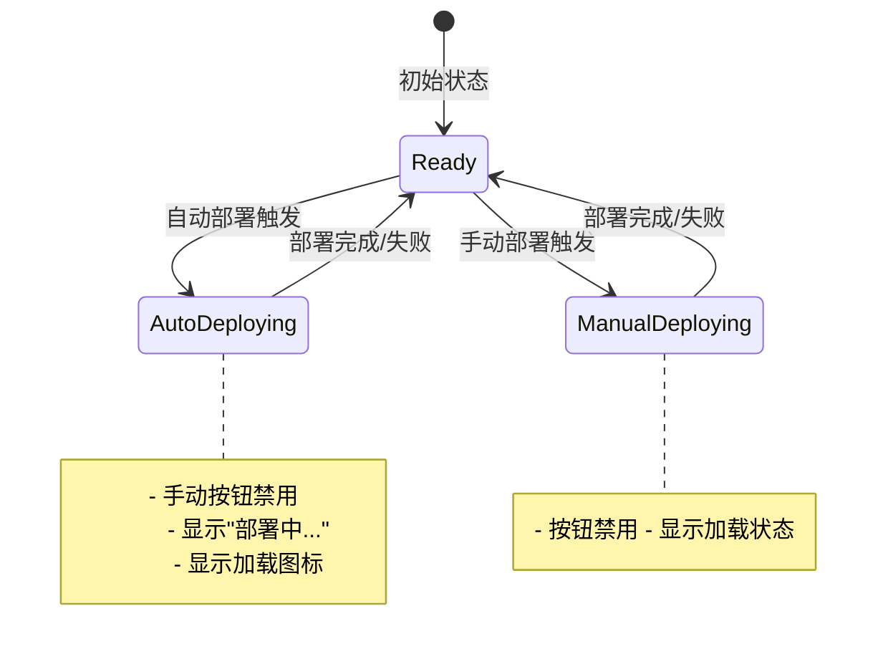

# 🚀 预览部署流程整合方案

## 🔍 **问题分析**

### 原始问题
目前预览部署有两个独立的流程：
1. **自动化部署**：项目完成后自动触发部署
2. **手动部署**：用户点击"立即部署预览"按钮

**问题**：两个流程没有共享状态，导致自动部署进行时，手动部署按钮仍然可以点击，可能造成冲突。

### 用户期望
- 自动化部署进行时，手动部署按钮应该显示 loading 状态并被禁用
- 统一的部署状态管理，避免重复部署

## 🛠️ **解决方案**

### 1. **统一部署状态管理**

#### A. 在 `CodePreviewToggle` 中添加自动部署状态
```typescript
// 新增状态管理
const [isAutoDeploying, setIsAutoDeploying] = useState(false);

// 自动部署时设置状态
const deployTimer = setTimeout(async () => {
  try {
    setIsAutoDeploying(true);  // 🆕 设置自动部署状态
    await onDeploy();
    setHasAutoDeployed(true);
  } catch (error) {
    console.error('❌ [自动部署] 部署失败:', error);
  } finally {
    setIsAutoDeploying(false); // 🆕 清除自动部署状态
  }
}, 1000);
```

#### B. 将自动部署状态传递给 `VercelPreview`
```typescript
<VercelPreview
  files={files}
  projectName={previewData?.projectName || '项目预览'}
  description={previewData?.description}
  isLoading={isAutoDeploying}           // 🆕 传递加载状态
  enableVercelDeploy={!isAutoDeploying} // 🆕 自动部署时禁用手动部署
  isGeneratingCode={isAutoDeploying}    // 🆕 显示生成状态
  generationStatus={isAutoDeploying ? '正在自动部署预览...' : ''}
  // ...其他props
/>
```

### 2. **改进手动部署按钮**

#### A. 按钮状态优化
```typescript
<Button
  onClick={handleDeploy}
  disabled={isDeploying || !enableVercelDeploy} // 🆕 考虑自动部署状态
  className={`flex items-center gap-2 px-6 py-3 font-medium rounded-lg shadow-lg transition-all duration-200 ${
    isDeploying || !enableVercelDeploy
      ? 'bg-gray-400 cursor-not-allowed'      // 🆕 禁用状态样式
      : 'bg-blue-600 hover:bg-blue-700 text-white hover:shadow-xl hover:scale-105'
  }`}
>
  {isDeploying || !enableVercelDeploy ? (
    <Loader2 className="w-5 h-5 animate-spin" />  // 🆕 加载图标
  ) : (
    <Play className="w-5 h-5" />
  )}
  {isDeploying || !enableVercelDeploy ? '部署中...' : '立即部署预览'}
</Button>
```

### 3. **刷新功能整合**

#### A. 防止重复部署
```typescript
onRefresh={async () => {
  console.log('🔄 [CodePreviewToggle] 刷新请求，重新部署...');
  if (onDeploy && !isAutoDeploying) {  // 🆕 检查自动部署状态
    try {
      setIsAutoDeploying(true);
      await onDeploy();
      console.log('✅ [CodePreviewToggle] 重新部署完成');
    } catch (error) {
      console.error('❌ [CodePreviewToggle] 重新部署失败:', error);
    } finally {
      setIsAutoDeploying(false);
    }
  }
}}
```

## 🎯 **整合效果**

### 修复前的问题
- ❌ 自动部署和手动部署可能同时进行
- ❌ 手动部署按钮在自动部署时仍可点击
- ❌ 用户体验混乱，不清楚当前部署状态

### 修复后的效果
- ✅ **统一状态管理**：自动部署状态在所有组件间共享
- ✅ **智能按钮禁用**：自动部署时手动按钮自动禁用并显示加载状态
- ✅ **清晰的用户反馈**：显示"正在自动部署预览..."状态
- ✅ **防止重复部署**：确保同一时间只有一个部署流程运行

## 🔄 **工作流程**

### 场景1：自动部署流程
```
项目完成 → 触发自动部署 → 设置 isAutoDeploying=true
         ↓
手动部署按钮禁用 → 显示"部署中..."加载状态
         ↓
部署完成 → 设置 isAutoDeploying=false → 按钮恢复正常
```

### 场景2：手动部署流程
```
用户点击"立即部署预览" → 检查 !isAutoDeploying
                    ↓
设置 isAutoDeploying=true → 执行部署 → 设置 isAutoDeploying=false
```

### 场景3：刷新部署流程
```
用户点击刷新 → 检查 !isAutoDeploying → 执行重新部署
```

## 📊 **状态流转图**



## 🎨 **UI 状态变化**

### 正常状态
```
[立即部署预览] ← 蓝色按钮，可点击
```

### 自动部署中
```
[⟳ 部署中...] ← 灰色按钮，禁用，带旋转图标
```

### 手动部署中
```
[⟳ 部署中...] ← 灰色按钮，禁用，带旋转图标
```

## 🔧 **技术实现细节**

### 关键文件修改

1. **`components/editor/CodePreviewToggle.tsx`**
   - 添加 `isAutoDeploying` 状态管理
   - 在自动部署逻辑中设置状态
   - 将状态传递给 `VercelPreview`

2. **`components/editor/VercelPreview.tsx`**
   - 接收 `enableVercelDeploy` 和 `isGeneratingCode` props
   - 改进按钮禁用逻辑和样式
   - 添加加载状态显示

### 状态传递链
```
CodePreviewToggle (isAutoDeploying) 
    ↓
VercelPreview (enableVercelDeploy, isGeneratingCode)
    ↓
Button (disabled, loading icon)
```

## ✅ **验证清单**

- [x] 自动部署时手动按钮被禁用
- [x] 按钮显示正确的加载状态和文本
- [x] 防止重复部署的逻辑正确
- [x] 状态在部署完成后正确重置
- [x] 错误处理不会导致状态卡死
- [x] 刷新功能考虑了部署状态

## 🎉 **总结**

这个整合方案实现了：

1. **统一的部署状态管理**：消除了自动部署和手动部署的状态冲突
2. **智能的UI响应**：按钮根据部署状态自动调整样式和行为
3. **清晰的用户反馈**：用户始终知道当前的部署状态
4. **可靠的防冲突机制**：确保同一时间只有一个部署流程运行

现在预览部署有了统一、可靠的流程，用户体验更加流畅和直观！
