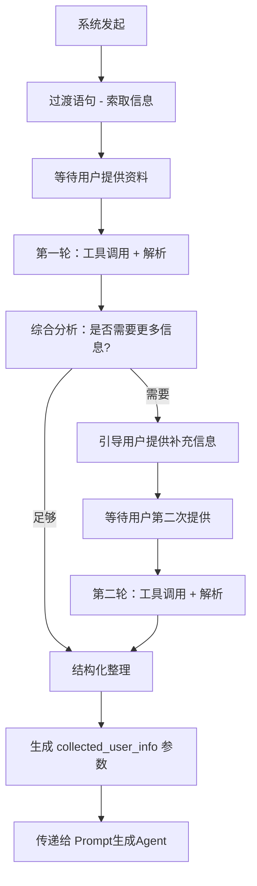

# 🎯 最终信息收集架构 V3

## 📋 核心流程设计

### 🔄 三阶段流程


### 📊 详细流程说明

#### 阶段 1: 系统引导 (System Initiation)
```typescript
// 系统发出过渡语句，引导用户提供信息
const TRANSITION_PROMPTS = {
  initial: `您好！为了为您创建一个精美的个人页面，我需要了解一些关于您的信息。

请提供以下任何一种或多种资料：
• 📋 您的简历或个人介绍文档
• 🔗 GitHub、LinkedIn、个人网站等链接
• 💬 或者直接告诉我您的背景和经历

请分享您的资料，我来帮您分析整理！`,
  
  supplementary: `基于您刚才提供的信息，我还想了解一些细节来完善您的档案：

{specific_questions_based_on_analysis}

请补充这些信息，或提供其他相关资料。`
};
```

#### 阶段 2: 用户资料收集 (User Input Collection)
```typescript
interface UserInputRound {
  roundNumber: 1 | 2;
  userInput: string;
  detectedLinks: string[];
  uploadedDocuments?: ParsedDocument[];
  
  // 工具调用结果
  toolCallResults: {
    github?: GitHubAnalysis;
    website?: WebsiteAnalysis;
    linkedin?: LinkedInAnalysis;
  };
  
  // 分析结果
  extractedInfo: ExtractedUserInfo;
  completenessScore: number;
  needsMoreInfo: boolean;
  specificQuestions?: string[];
}
```

#### 阶段 3: 结构化整理 (Structured Organization)
```typescript
interface CollectedUserInfo {
  // 基本信息
  basicProfile: {
    name: string;
    title: string;
    bio: string;
    location?: string;
    contact?: ContactInfo;
  };
  
  // 专业技能
  skills: {
    technical: string[];
    soft: string[];
    languages: string[];
    certifications: string[];
  };
  
  // 工作经验
  experience: {
    current_role?: WorkExperience;
    work_history: WorkExperience[];
    projects: Project[];
  };
  
  // 成就亮点
  achievements: {
    awards: string[];
    recognitions: string[];
    metrics: string[];
    testimonials: string[];
  };
  
  // 在线存在
  online_presence: {
    github_url?: string;
    linkedin_url?: string;
    website_url?: string;
    portfolio_links: string[];
  };
  
  // 元数据
  metadata: {
    data_sources: string[];
    confidence_score: number;
    collection_rounds: number;
    last_updated: string;
  };
}
```

---

## 🛠️ 实现架构

### 📝 核心 Agent 类
```typescript
export class InfoCollectionAgentV3 extends BaseAgentV2 {
  private currentRound: number = 0;
  private maxRounds: number = 2;
  private collectedData: Partial<CollectedUserInfo> = {};
  
  async *processRequest(
    userInput: string,
    sessionData: SessionData,
    context?: Record<string, any>
  ): AsyncGenerator<StreamableAgentResponse, void, unknown> {
    
    if (this.currentRound === 0) {
      // 系统引导阶段
      yield* this.initiateCollection(sessionData, context);
      return;
    }
    
    if (this.currentRound <= this.maxRounds) {
      // 用户资料收集阶段
      yield* this.processUserInput(userInput, sessionData, context);
      return;
    }
    
    // 超出轮次，直接结构化
    yield* this.finalizeCollection(sessionData, context);
  }
  
  private async *initiateCollection(
    sessionData: SessionData,
    context?: Record<string, any>
  ): AsyncGenerator<StreamableAgentResponse, void, unknown> {
    this.currentRound = 1;
    
    yield this.createResponse({
      immediate_display: {
        reply: TRANSITION_PROMPTS.initial
      },
      system_state: {
        intent: 'awaiting_user_input',
        done: false,
        progress: 10,
        current_stage: '等待用户提供资料',
        metadata: {
          round: this.currentRound,
          max_rounds: this.maxRounds
        }
      }
    });
  }
  
  private async *processUserInput(
    userInput: string,
    sessionData: SessionData,
    context?: Record<string, any>
  ): AsyncGenerator<StreamableAgentResponse, void, unknown> {
    
    // 1. 工具调用和解析
    yield this.createThinkingResponse('🔍 正在分析您提供的信息...', 30);
    
    const analysisResult = await this.analyzeUserInput(userInput, sessionData, context);
    
    // 2. 更新收集的数据
    this.updateCollectedData(analysisResult);
    
    // 3. 综合分析是否需要更多信息
    const completenessAssessment = this.assessCompleteness();
    
    if (completenessAssessment.needsMoreInfo && this.currentRound < this.maxRounds) {
      // 需要更多信息，进入下一轮
      this.currentRound++;
      
      const supplementaryPrompt = this.generateSupplementaryPrompt(completenessAssessment);
      
      yield this.createResponse({
        immediate_display: {
          reply: `✅ 已分析您的资料！${analysisResult.summary}\n\n${supplementaryPrompt}`
        },
        system_state: {
          intent: 'awaiting_supplementary_input',
          done: false,
          progress: 50,
          current_stage: `等待补充信息 (第${this.currentRound}轮)`,
          metadata: {
            round: this.currentRound,
            completeness_score: completenessAssessment.score,
            missing_areas: completenessAssessment.missingAreas
          }
        }
      });
    } else {
      // 信息足够或达到最大轮次，进行结构化整理
      yield* this.finalizeCollection(sessionData, context);
    }
  }
  
  private async *finalizeCollection(
    sessionData: SessionData,
    context?: Record<string, any>
  ): AsyncGenerator<StreamableAgentResponse, void, unknown> {
    
    yield this.createThinkingResponse('🎯 正在整理和结构化您的信息...', 80);
    
    // 使用专门的结构化 prompt 整理信息
    const structuredInfo = await this.structurizeCollectedInfo(
      this.collectedData,
      context
    );
    
    yield this.createResponse({
      immediate_display: {
        reply: `🎉 信息收集完成！我已经整理了您的完整档案，包含了您的专业背景、技能特长和成就亮点。现在开始为您生成个性化页面...`
      },
      system_state: {
        intent: 'collection_complete',
        done: true,
        progress: 100,
        current_stage: '信息收集完成',
        next_agent: 'prompt_generation_agent',
        metadata: {
          collected_user_info: structuredInfo,
          total_rounds: this.currentRound,
          data_sources: structuredInfo.metadata.data_sources,
          confidence_score: structuredInfo.metadata.confidence_score
        }
      }
    });
  }
}
```

### 🔧 工具调用策略
```typescript
private async analyzeUserInput(
  userInput: string,
  sessionData: SessionData,
  context?: Record<string, any>
): Promise<AnalysisResult> {
  
  // 检测链接和文档
  const detectedLinks = this.detectLinks(userInput);
  const hasDocuments = context?.parsedDocuments?.length > 0;
  
  if (detectedLinks.length === 0 && !hasDocuments) {
    // 纯文本输入，直接提取信息
    return await this.extractFromText(userInput);
  }
  
  // 构建工具调用 prompt
  const toolPrompt = this.buildToolCallPrompt(userInput, detectedLinks, context);
  
  // 执行多步骤工具调用
  const result = await this.executeMultiStepWorkflow(
    userInput,
    sessionData,
    toolPrompt,
    4 // 最多4步用于工具调用
  );
  
  return {
    summary: result.text,
    toolResults: result.toolResults,
    extractedInfo: this.extractInfoFromResults(result.toolResults, userInput),
    confidence: this.calculateConfidence(result.toolResults)
  };
}
```

### 📊 结构化整理 Prompt
```typescript
private async structurizeCollectedInfo(
  collectedData: Partial<CollectedUserInfo>,
  context?: Record<string, any>
): Promise<CollectedUserInfo> {
  
  const structurePrompt = `请将收集到的用户信息结构化整理成标准格式：

收集到的原始信息：
${JSON.stringify(collectedData, null, 2)}

用户上下文：
- 角色：${context?.welcomeData?.user_role}
- 用途：${context?.welcomeData?.use_case}
- 文档内容：${context?.parsedDocuments?.map(d => d.content).join('\n')}

请按照 CollectedUserInfo 接口格式，将信息整理成结构化数据。
确保信息完整、准确，并填补合理的默认值。`;

  const result = await generateText({
    model: anthropic('claude-3-5-sonnet-20241022'),
    messages: [{ role: 'user', content: structurePrompt }],
    temperature: 0.3,
    maxTokens: 4000
  });
  
  // 解析结构化结果
  return this.parseStructuredResult(result.text, collectedData);
}
```

---

## 🎯 关键特性

### ✅ 优势
1. **明确的轮次控制**: 最多2轮用户输入，避免无限循环
2. **智能判断**: AI 自动判断是否需要补充信息
3. **结构化输出**: 标准化的 `collected_user_info` 参数
4. **Token 优化**: 文档内容仅在最终结构化时使用
5. **用户体验**: 清晰的进度提示和引导

### 🔧 实现要点
1. **状态管理**: 跟踪当前轮次和收集状态
2. **工具调用**: 基于用户输入智能选择工具
3. **完整度评估**: 动态判断信息完整度
4. **结构化处理**: 专门的 prompt 进行最终整理
5. **错误恢复**: 优雅处理工具调用失败

### 📈 预期效果
- **用户体验**: 清晰的两轮交互，不会感到困惑
- **信息质量**: 通过智能分析确保信息完整性
- **系统效率**: 明确的结束条件，避免过度收集
- **标准化输出**: 为后续 Agent 提供结构化数据
