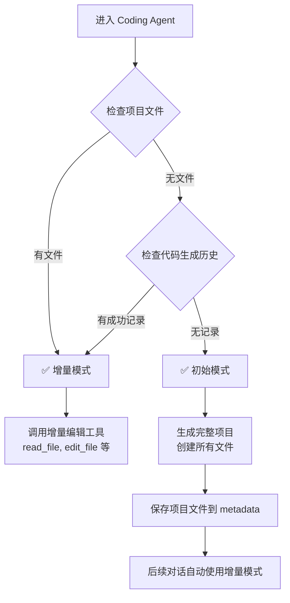

# 🎯 Coding Agent 增量模式逻辑 - 最终版本

## 🔍 **核心设计原则**

基于用户反馈，我们采用了更简洁、更符合直觉的判断逻辑：

> **"有代码就增量，无代码就初始"**

## 🎯 **判断逻辑**

### 简化的核心逻辑
```typescript
// 🎯 简化的判断逻辑：核心原则是"有代码就增量，无代码就初始"
const shouldUseIncremental = hasProjectFiles || hasSuccessfulCodeGeneration;
```

### 具体检查条件

#### 1. **项目文件检查** (最可靠指标)
```typescript
const hasProjectFiles = session.metadata && 
                        (session.metadata as any).projectFiles && 
                        (session.metadata as any).projectFiles.length > 0;
```

#### 2. **成功代码生成历史检查**
```typescript
const hasSuccessfulCodeGeneration = session.conversationHistory.some(entry => 
  (entry.agent === 'coding' && entry.metadata?.projectGenerated === true) ||
  entry.metadata?.intent === 'project_complete' ||
  entry.metadata?.hasCodeFiles === true
);
```

## 🔄 **工作流程场景**

### 场景1：专业模式首次进入
```
用户 → 选择专业模式 → 直接进入coding agent
检查：❌ 无项目文件，❌ 无代码生成历史
结果：✅ 使用 initial 模式 → 生成完整项目
```

### 场景2：普通模式完成流程后进入coding
```
用户 → 完成信息收集和设计 → 进入coding agent
检查：❌ 无项目文件，❌ 无代码生成历史  
结果：✅ 使用 initial 模式 → 生成完整项目
```

### 场景3：已生成代码后的任何对话
```
用户 → 请求修改代码
检查：✅ 有项目文件 或 ✅ 有代码生成历史
结果：✅ 使用 incremental 模式 → 调用编辑工具
```

### 场景4：会话恢复后的对话
```
用户 → 重新打开会话 → 请求修改
检查：✅ 会话中有项目文件
结果：✅ 使用 incremental 模式 → 调用编辑工具
```

## 📊 **判断流程图**



## 🎯 **关键优势**

### 1. **简洁明了**
- 不依赖复杂的 `currentStage` 状态
- 不区分专业模式和普通模式
- 只关注"是否已有代码"这一核心问题

### 2. **可靠性高**
- 项目文件是最直接的证据
- 代码生成历史作为备用检查
- 避免了状态同步问题

### 3. **用户体验好**
- 专业模式首次进入：生成完整项目 ✅
- 普通模式首次进入：生成完整项目 ✅  
- 任何后续对话：智能增量编辑 ✅

### 4. **开发友好**
- 逻辑简单，易于理解和维护
- 调试信息清晰，便于排查问题
- 扩展性好，未来可以轻松调整

## 🔧 **调试信息**

### 增量模式日志
```
🔧 [编排器] CodingAgent使用增量模式 - 检测到已有代码 {
  hasProjectFiles: true,
  projectFilesCount: 7,
  hasSuccessfulCodeGeneration: true,
  reason: '有项目文件'
}
```

### 初始模式日志
```
🔧 [编排器] CodingAgent使用初始模式 - 首次代码生成 {
  hasProjectFiles: false,
  hasSuccessfulCodeGeneration: false,
  isFirstTimeGeneration: true
}
```

## 🧪 **测试场景**

### ✅ 应该使用初始模式的情况
1. **专业模式首次进入**：无任何代码历史
2. **普通模式首次进入coding**：完成设计后第一次生成代码
3. **全新会话**：没有任何项目文件和历史

### ✅ 应该使用增量模式的情况
1. **生成代码后的修改请求**：有项目文件
2. **会话恢复后的对话**：会话中保存了项目文件
3. **任何有代码生成历史的会话**：即使项目文件丢失，历史记录仍可检测

## 📈 **性能和可靠性**

### 检查顺序优化
1. **优先检查项目文件**：最直接、最可靠
2. **备用检查历史记录**：防止文件丢失的情况
3. **快速判断**：避免复杂的状态分析

### 容错机制
- 即使项目文件意外丢失，历史记录仍能正确判断
- 即使历史记录不完整，项目文件仍能准确指示
- 双重检查确保判断的可靠性

## 🎉 **总结**

这个最终版本的逻辑实现了：

1. **专业模式正常工作**：首次进入生成完整项目
2. **增量编辑正确触发**：有代码后自动使用增量模式  
3. **逻辑简洁可靠**：不依赖复杂状态，易于维护
4. **用户体验优秀**：符合直觉，行为可预测

现在无论是专业模式还是普通模式，都能正确地在首次生成完整项目，然后在后续对话中智能地使用增量编辑模式！
