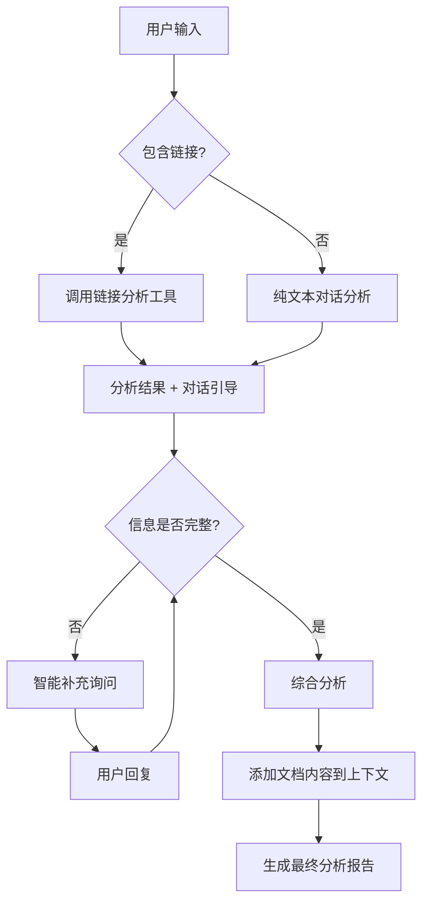

# 🚀 优化后的 Agent 架构设计 V2

## 🎯 核心优化原则

### ✅ 保留功能
- **对话式收集**: 纯对话交互，智能引导用户提供信息
- **链接分析**: GitHub、网站、LinkedIn 等链接的智能分析
- **综合分析**: 基于收集信息的智能综合分析

### ❌ 移除功能
- **表单收集**: 不再使用结构化表单
- **文档解析工具**: 前端直接调用 API 解析，Agent 不调用工具

### 🔧 优化策略
- **Token 优化**: 文档内容在综合分析时才加入上下文
- **交互简化**: 纯对话式，更自然的用户体验
- **智能补充**: AI 判断信息完整度，主动询问缺失部分

---

## 🏗️ 新架构设计

### 📊 信息收集 Agent V2

#### 🎯 核心流程


#### 🛠️ 工具集简化
```typescript
const TOOLS_V2 = {
  // 保留的工具
  analyze_github: '分析 GitHub 用户和仓库',
  scrape_webpage: '抓取网页内容',
  extract_linkedin: '提取 LinkedIn 信息',
  synthesize_profile: '综合分析所有信息',
  
  // 移除的工具
  // parse_document: '移除 - 前端直接解析'
}
```

#### 📝 数据流设计
```typescript
interface CollectionContext {
  // 用户输入的文本信息
  userInput: string;
  
  // 前端解析的文档内容（仅在综合分析时使用）
  parsedDocuments?: {
    fileName: string;
    content: string;
    type: 'pdf' | 'docx' | 'txt';
    summary: string; // 前端提供的简要摘要
  }[];
  
  // 链接分析结果
  linkAnalysis?: {
    github?: any;
    website?: any;
    linkedin?: any;
  };
  
  // 对话历史
  conversationHistory: Message[];
  
  // 信息完整度评估
  completenessScore: number;
  missingAreas: string[];
}
```

---

## 💬 对话式收集策略

### 🎯 智能引导原则
1. **自然对话**: 不使用表单，通过对话自然收集
2. **智能判断**: AI 判断哪些信息还需要补充
3. **主动询问**: 基于已有信息，主动询问关键缺失点
4. **用户友好**: 让用户感觉在聊天，而不是填表

### 📋 收集完整度判断
```typescript
interface CompletenessAssessment {
  basicInfo: boolean;     // 姓名、角色、基本介绍
  skills: boolean;        // 技能和专长
  experience: boolean;    // 工作经验或项目经历
  achievements: boolean;  // 成就和亮点
  goals: boolean;         // 目标和愿景
  
  overallScore: number;   // 0-1 的完整度分数
  readyToAdvance: boolean; // 是否可以推进到下一阶段
}
```

### 🤖 智能补充询问策略
```typescript
const SMART_QUESTIONS = {
  missingSkills: [
    "您最擅长的技能是什么？",
    "有什么特别的专长或爱好吗？"
  ],
  missingExperience: [
    "能简单介绍一下您的工作经历吗？",
    "有什么项目或经历让您特别有成就感？"
  ],
  missingAchievements: [
    "有什么成就或获得的认可想要展示吗？",
    "朋友们通常会因为什么来找您帮忙？"
  ]
};
```

---

## 🔧 Token 优化策略

### 📊 分层上下文管理
```typescript
interface ContextLayers {
  // 第一层：基础对话（始终在上下文中）
  coreConversation: {
    systemPrompt: string;
    recentMessages: Message[];
    userProfile: BasicProfile;
  };
  
  // 第二层：链接分析结果（工具调用后添加）
  linkAnalysis: {
    github?: GitHubAnalysis;
    website?: WebsiteAnalysis;
    linkedin?: LinkedInAnalysis;
  };
  
  // 第三层：文档内容（仅在综合分析时添加）
  documentContent: {
    summary: string;        // 简要摘要，始终包含
    fullContent?: string;   // 完整内容，仅综合分析时添加
  };
}
```

### 💡 Token 使用优化
1. **日常对话**: 只使用第一层上下文
2. **链接分析**: 添加第二层上下文
3. **综合分析**: 添加第三层完整文档内容
4. **智能摘要**: 文档内容先生成摘要，需要时再使用完整内容

---

## 🎯 实现计划

### 阶段 1: 基础架构
- [x] 设计新的 BaseAgent 架构
- [ ] 实现简化的工具集
- [ ] 设计对话式收集流程

### 阶段 2: 信息收集 Agent
- [ ] 实现智能对话引导
- [ ] 集成链接分析工具
- [ ] 实现信息完整度判断

### 阶段 3: Token 优化
- [ ] 实现分层上下文管理
- [ ] 优化文档内容处理
- [ ] 实现智能摘要功能

### 阶段 4: 测试和优化
- [ ] 对话流程测试
- [ ] Token 使用量对比
- [ ] 用户体验优化

---

## 📈 预期效果

### 🚀 用户体验提升
- **更自然**: 纯对话交互，无表单填写
- **更智能**: AI 主动判断和询问缺失信息
- **更高效**: 减少不必要的信息收集步骤

### 💰 成本优化
- **Token 减少**: 文档内容按需加载
- **工具调用减少**: 移除文档解析工具
- **响应更快**: 减少不必要的 API 调用

### 🔧 维护简化
- **代码更简洁**: 移除复杂的表单逻辑
- **逻辑更清晰**: 纯对话式流程
- **错误更少**: 减少工具调用失败的情况
