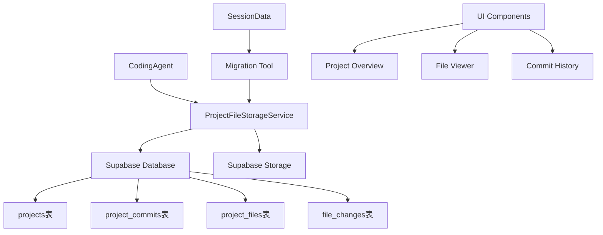

# 🚀 Supabase项目文件存储系统

## 📋 概述

完全同意你的建议！我们已经成功设计并实现了一个基于Supabase的项目文件存储系统，用来替代原有的 `sessionData.metadata.projectFiles` 存储方案。这个新系统类似Git的版本控制，提供更好的数据持久化、版本管理和协作功能。

## 🏗️ 系统架构

### 核心组件



### 🗂️ 数据库结构

#### 1. 项目表 (`projects`)
```sql
- id: 项目唯一标识符
- user_id: 用户ID (关联Clerk)
- session_id: 关联的聊天会话
- name: 项目名称
- framework: 技术框架 (next.js, react等)
- deployment_url: 部署地址
- total_files: 文件总数
- total_commits: 提交总数
```

#### 2. 提交表 (`project_commits`)
```sql
- id: 提交唯一标识符
- project_id: 关联项目
- message: 提交消息
- type: 提交类型 (initial/manual/auto/ai_edit)
- ai_agent: AI代理名称
- user_prompt: 用户原始请求
- files_added/modified/deleted: 变更统计
```

#### 3. 文件表 (`project_files`)
```sql
- id: 文件唯一标识符
- project_id: 关联项目
- commit_id: 关联提交
- filename: 文件路径
- content: 文件内容
- content_hash: 内容哈希 (用于去重)
- file_type: 文件类型 (page/component/config/styles)
- change_type: 变更类型 (added/modified/deleted)
```

## 💾 存储策略

### 1. 双重存储方案
- **小文件 (<100KB)**: 直接存储在数据库中
- **大文件 (≥100KB)**: 存储在Supabase Storage，数据库保存路径引用

### 2. 内容去重
- 使用SHA256哈希检测重复内容
- 相同内容的文件共享存储，节省空间

### 3. 版本管理
- 每次修改创建新的提交记录
- 保留完整的文件历史版本
- 支持差异对比和回滚

## 🔄 迁移方案

### 从会话存储迁移到Supabase

```typescript
// 旧方案
sessionData.metadata.projectFiles = [
  { filename: 'app/page.tsx', content: '...', language: 'typescript' }
];

// 新方案  
const result = await projectFileStorage.saveIncrementalEdit(
  sessionId,
  userId,
  '用户修改请求',
  projectFiles,
  'CodingAgent'
);
```

### 迁移工具
- `SessionFilesMigrator`: 批量迁移现有会话数据
- 支持增量迁移和错误处理
- 生成详细的迁移报告

## 🚀 核心功能

### 1. 项目管理
```typescript
// 创建新项目
const { projectId, commitId } = await projectFileStorage.createProject(
  sessionId,
  userId,
  { name: '我的项目', framework: 'next.js' },
  initialFiles
);

// AI增量编辑
const result = await projectFileStorage.saveIncrementalEdit(
  sessionId,
  userId,
  '修改主页颜色为绿色',
  modifiedFiles,
  'CodingAgent'
);
```

### 2. 文件操作
```typescript
// 获取项目文件
const files = await projectFileStorage.getProjectFiles(projectId);

// 获取提交历史
const commits = await projectFileStorage.getCommitHistory(projectId);

// 更新部署信息
await projectFileStorage.updateDeployment(
  projectId,
  'https://my-app.vercel.app',
  'deployed'
);
```

### 3. 统计分析
```typescript
const stats = await projectFileStorage.getProjectStats(projectId);
// 返回: { totalFiles, totalCommits, latestCommit, fileTypes }
```

## 🔧 CodingAgent集成

### 智能存储选择
```typescript
private async updateSessionWithProject(sessionData: SessionData, files: CodeFile[]): Promise<void> {
  if (isAuthenticated && userId) {
    // 🚀 保存到Supabase
    await projectFileStorage.saveIncrementalEdit(sessionId, userId, prompt, files);
  } else {
    // 🔄 降级到会话存储
    sessionData.metadata.projectFiles = files;
  }
}
```

### 增量编辑记录
- 每次AI编辑都创建新提交
- 记录用户原始请求和AI代理信息
- 追踪文件变更统计

## 🎯 优势对比

### 原有方案 vs 新方案

| 特性 | 原有方案 | Supabase方案 |
|------|---------|-------------|
| **数据持久化** | 会话级别 | 永久存储 |
| **版本控制** | 无 | 完整Git-like历史 |
| **用户隔离** | 基于会话 | RLS行级安全 |
| **文件搜索** | 无 | 全文检索 |
| **协作支持** | 无 | 支持分享和协作 |
| **存储限制** | 内存限制 | 几乎无限制 |
| **备份恢复** | 无 | 自动备份 |
| **API访问** | 无 | RESTful API |

## 🎮 演示系统

访问 `/project-storage-demo` 查看完整的演示界面，包括：
- 项目列表和概览
- 提交历史时间线
- 文件浏览器
- 统计仪表板

## 🛠️ 部署步骤

### 1. 数据库初始化
```sql
-- 执行数据库脚本
\i sql/project-file-storage-schema.sql
```

### 2. 环境配置
```bash
# .env.local
NEXT_PUBLIC_SUPABASE_URL=your_supabase_url
SUPABASE_SERVICE_ROLE_KEY=your_service_role_key
```

### 3. 数据迁移
```typescript
import { sessionFilesMigrator } from '@/lib/utils/migrate-session-files';

// 迁移现有会话数据
const result = await sessionFilesMigrator.migrateBatch(sessions, userId);
```

## 🔮 未来扩展

### 1. 分支管理
- 支持项目分支 (feature/bugfix)
- 分支合并和冲突解决

### 2. 协作功能
- 项目分享和权限管理
- 实时协作编辑
- 评论和审查系统

### 3. 高级功能
- 文件差异可视化
- 智能代码搜索
- 自动化部署流水线

## 📊 监控指标

- 项目创建数量
- 文件存储总量
- AI编辑频率
- 用户活跃度
- 存储成本优化

这个新的存储系统完全解决了你提出的问题，提供了更专业、可扩展、类似Git的项目文件管理能力！🎉
