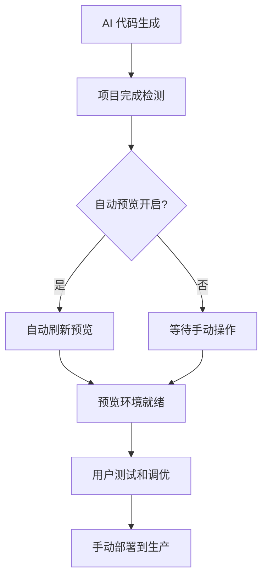

# Vercel 环境架构指南

## 🎯 概述

我们已经重新设计了 Vercel 集成架构，明确区分了预览环境和生产环境，与 Vercel 的官方环境概念保持一致。

## 🏗️ 环境架构

### 1. **预览环境 (Preview Environment)**
- **目的**: 代码预览、测试和协作
- **组件**: `VercelPreview.tsx`
- **特点**:
  - 自动部署到 Vercel Preview 环境
  - 支持自动预览功能（项目完成后自动刷新）
  - 提供可视化编辑功能
  - 设备响应式预览
  - 实时内容更新

### 2. **生产环境 (Production Environment)**  
- **目的**: 正式发布和用户访问
- **组件**: `VercelDeploy.tsx`
- **特点**:
  - 手动部署到 Vercel Production 环境
  - 部署历史记录
  - 生产域名管理
  - 部署状态监控
  - 详细部署日志

## 🔧 组件结构

```
CodePreviewToggle
├── 预览模式 (Preview)
│   └── VercelPreview 组件
│       ├── 自动预览开关
│       ├── 刷新预览按钮
│       ├── 设备切换
│       └── 可视化编辑
│
├── 代码模式 (Code)
│   └── CodeEditorPanel 组件
│       ├── 文件树
│       ├── Monaco 编辑器
│       └── 语法高亮
│
└── 部署模式 (Deploy)
    └── VercelDeploy 组件
        ├── 生产部署按钮
        ├── 部署历史
        ├── 状态监控
        └── 域名管理
```

## 📝 核心特性

### 预览环境特性
- ✅ **自动预览**: 项目完成后自动刷新预览
- ✅ **实时编辑**: 支持文本和 AI 辅助编辑
- ✅ **响应式预览**: 桌面/移动设备切换
- ✅ **即时更新**: 代码变更实时反映

### 生产环境特性
- ✅ **手动部署**: 确保生产环境稳定性
- ✅ **版本管理**: 部署历史和回滚功能
- ✅ **状态监控**: 实时部署状态跟踪
- ✅ **域名管理**: 生产域名和 SSL 证书

## 🚀 使用流程

### 开发流程
1. **代码生成** → AI Agent 生成项目代码
2. **预览测试** → 自动或手动刷新预览环境
3. **代码调优** → 使用代码编辑器和可视化工具
4. **生产部署** → 手动部署到生产环境

### 自动化流程


## ⚙️ 配置说明

### 环境变量配置
```bash
# Vercel 基础配置
ENABLE_VERCEL_PREVIEW=true
VERCEL_TOKEN=your_vercel_token_here
VERCEL_TEAM_ID=your_team_id_here  
VERCEL_TEAM_SLUG=your_team_slug_here
```

### 获取 Vercel Token
1. 访问 [Vercel Dashboard](https://vercel.com/account/tokens)
2. 创建新的 Access Token
3. 确保 Token 有足够权限进行部署操作

## 🎨 用户界面

### 视图切换
- **预览标签**: 显示实时预览和编辑工具
- **代码标签**: 显示代码编辑器和文件管理
- **部署标签**: 显示生产部署和管理工具

### 状态指示
- **环境徽章**: 清晰显示当前操作的环境
- **部署状态**: 实时显示部署进度和结果
- **自动化标识**: 显示自动预览的开启状态

## 🔍 最佳实践

### 开发阶段
1. **启用自动预览**: 代码生成后立即查看效果
2. **频繁测试**: 利用预览环境进行快速迭代
3. **设备测试**: 使用响应式预览确保兼容性

### 部署阶段  
1. **预览确认**: 在预览环境充分测试后再部署
2. **分步部署**: 重要更新建议分阶段部署
3. **监控状态**: 关注部署状态和错误日志

## 🚨 注意事项

### 环境隔离
- **预览环境**: 用于开发和测试，可能不稳定
- **生产环境**: 用于正式发布，需要谨慎操作
- **数据安全**: 生产环境数据不会同步到预览环境

### 资源管理
- **预览部署**: 会自动清理旧的预览版本
- **生产部署**: 保持历史版本用于回滚
- **存储限制**: 注意 Vercel 账户的存储和带宽限制

## 📚 相关文档

- [Vercel 官方环境文档](https://vercel.com/docs/environments)
- [Vercel SDK 文档](https://vercel.com/docs/rest-api)
- [项目集成指南](./CODING_AGENT_IMPLEMENTATION_GUIDE.md)

---

最后更新: 2025-01-26
版本: 2.0.0 