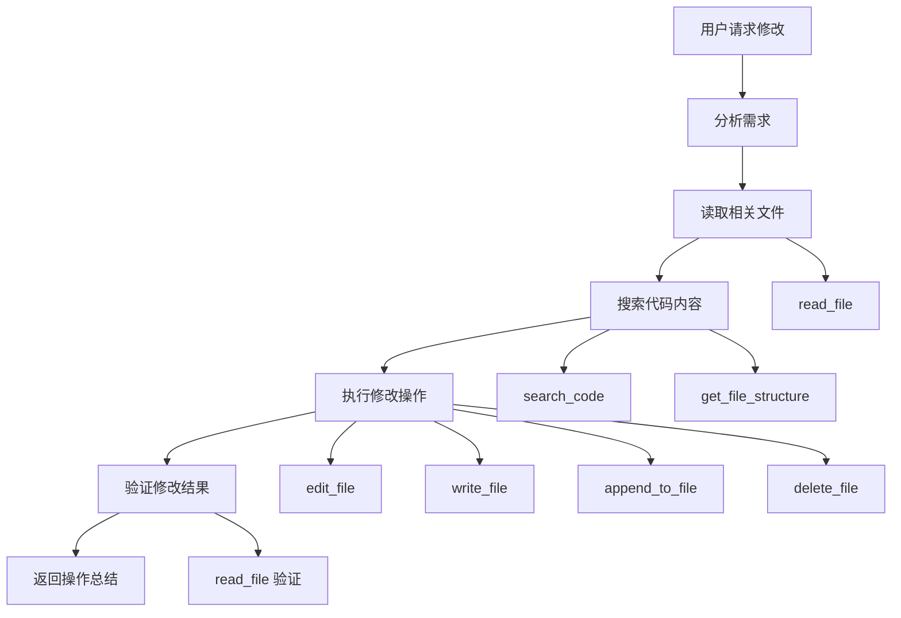

# 工具实现对生成文档的操作指南

## 🎯 **概览**

HeysMe平台的Coding Agent通过一套完整的工具系统来处理对之前生成文档的操作，包括读取、修改、编辑、搜索和管理现有的代码文件。

## 📁 **代码实现位置**

### 🗂️ **核心文件**

| 文件 | 功能 | 位置 |
|------|------|------|
| **agent.ts** | 主要工具执行逻辑 | `/lib/agents/coding/agent.ts` |
| **enhanced-tool-executor.ts** | 增强的工具执行器 | `/lib/agents/coding/enhanced-tool-executor.ts` |
| **incremental-edit.ts** | 工具定义和提示词 | `/lib/prompts/coding/incremental-edit.ts` |

### 🔧 **工具执行入口**
```typescript
// 位置: lib/agents/coding/agent.ts (1528-1572行)
private async executeIncrementalTool(
  toolName: string, 
  params: Record<string, any>, 
  existingFiles: CodeFile[], 
  modifiedFiles: CodeFile[]
): Promise<string>
```

## 🛠️ **完整工具清单**

### 📖 **文件读取工具**

#### 1. **read_file** - 读取文件内容
```typescript
// 实现位置: agent.ts (1574-1592行)
private async handleReadFile(params: any, existingFiles: CodeFile[]): Promise<string>

// 用法示例:
{"type":"tool_use","name":"read_file","input":{"file_path":"app/page.tsx"}}
{"type":"tool_use","name":"read_file","input":{"file_path":"app/page.tsx","start_line":10,"end_line":20}}
```

**功能特点:**
- ✅ 支持读取完整文件内容
- ✅ 支持指定行号范围读取
- ✅ 自动查找文件并返回内容
- ✅ 处理文件不存在的情况

### ✏️ **文件编辑工具**

#### 2. **write_file** - 写入文件
```typescript
// 实现位置: agent.ts (1597-1629行)
private async handleWriteFile(params: any, existingFiles: CodeFile[], modifiedFiles: CodeFile[]): Promise<string>

// 用法示例:
{"type":"tool_use","name":"write_file","input":{"file_path":"components/NewButton.tsx","content":"import React from 'react';\n\nexport default function NewButton() {\n  return <button>Click me</button>;\n}"}}
```

**功能特点:**
- ✅ 创建新文件或完全重写现有文件
- ✅ 自动检测编程语言
- ✅ 更新修改文件列表
- ✅ 返回详细的操作结果

#### 3. **edit_file** - 精确编辑文件
```typescript
// 实现位置: agent.ts (1634-1676行)
private async handleEditFile(params: any, existingFiles: CodeFile[], modifiedFiles: CodeFile[]): Promise<string>

// 用法示例:
{"type":"tool_use","name":"edit_file","input":{"file_path":"app/page.tsx","old_content":"<h1>Hello World</h1>","new_content":"<h1>Welcome to HeysMe</h1>"}}
```

**功能特点:**
- ✅ 精确替换指定内容
- ✅ 支持多行内容替换
- ✅ 智能查找替换位置
- ✅ 验证替换是否成功

#### 4. **append_to_file** - 追加内容
```typescript
// 实现位置: agent.ts (1681-1716行)
private async handleAppendToFile(params: any, existingFiles: CodeFile[], modifiedFiles: CodeFile[]): Promise<string>

// 用法示例:
{"type":"tool_use","name":"append_to_file","input":{"file_path":"app/globals.css","content":"\\n\\n/* 新增样式 */\\n.custom-button { background: blue; }"}}
```

**功能特点:**
- ✅ 在文件末尾追加内容
- ✅ 自动添加换行符
- ✅ 适合添加新的CSS规则、函数等

#### 5. **delete_file** - 删除文件
```typescript
// 实现位置: agent.ts (1721-1752行)
private async handleDeleteFile(params: any, existingFiles: CodeFile[], modifiedFiles: CodeFile[]): Promise<string>

// 用法示例:
{"type":"tool_use","name":"delete_file","input":{"file_path":"components/OldComponent.tsx"}}
```

**功能特点:**
- ✅ 标记文件为删除状态
- ✅ 安全的删除机制（标记而非直接删除）
- ✅ 支持撤销操作

### 🔍 **代码分析工具**

#### 6. **search_code** - 代码搜索
```typescript
// 实现位置: agent.ts (1757-1791行)
private async handleSearchCode(params: any, existingFiles: CodeFile[]): Promise<string>

// 用法示例:
{"type":"tool_use","name":"search_code","input":{"query":"useState"}}
{"type":"tool_use","name":"search_code","input":{"query":"export default","file_pattern":"components"}}
```

**功能特点:**
- ✅ 全文搜索代码内容
- ✅ 支持文件模式过滤
- ✅ 返回文件名、行号和匹配内容
- ✅ 限制结果数量防止输出过长

#### 7. **get_file_structure** - 获取文件结构
```typescript
// 实现位置: agent.ts (1796-1829行)
private async handleGetFileStructure(params: any, existingFiles: CodeFile[]): Promise<string>

// 用法示例:
{"type":"tool_use","name":"get_file_structure","input":{}}
{"type":"tool_use","name":"get_file_structure","input":{"directory":"components"}}
```

**功能特点:**
- ✅ 显示项目文件树结构
- ✅ 支持指定目录过滤
- ✅ 文件夹和文件分类显示
- ✅ 清晰的树状结构输出

#### 8. **list_files** - 列出文件清单
```typescript
// 实现位置: agent.ts (1860-1863行)
private async handleListFiles(existingFiles: CodeFile[]): Promise<string>

// 用法示例:
{"type":"tool_use","name":"list_files","input":{}}
```

**功能特点:**
- ✅ 简洁的文件列表
- ✅ 显示文件类型信息
- ✅ 快速概览项目文件

### 🚀 **执行工具**

#### 9. **run_command** - 执行命令
```typescript
// 实现位置: agent.ts (1834-1855行)
private async handleRunCommand(params: any): Promise<string>

// 用法示例:
{"type":"tool_use","name":"run_command","input":{"command":"npm install"}}
{"type":"tool_use","name":"run_command","input":{"command":"npm run build","directory":"."}}
```

**功能特点:**
- ✅ 模拟常见命令执行（出于安全考虑）
- ✅ 支持npm、git等常用命令
- ✅ 可指定执行目录
- ✅ 返回模拟执行结果

## 🔄 **工具调用流程**

### 📋 **典型的文档操作流程**



### 🎯 **实际操作示例**

#### 示例1: 修改组件样式
```typescript
// 1. 读取现有组件
{"type":"tool_use","name":"read_file","input":{"file_path":"components/Hero.tsx"}}

// 2. 搜索样式相关代码
{"type":"tool_use","name":"search_code","input":{"query":"className","file_pattern":"Hero"}}

// 3. 编辑组件样式
{"type":"tool_use","name":"edit_file","input":{"file_path":"components/Hero.tsx","old_content":"className=\"text-blue-500\"","new_content":"className=\"text-purple-600 font-bold\""}}

// 4. 验证修改
{"type":"tool_use","name":"read_file","input":{"file_path":"components/Hero.tsx","start_line":15,"end_line":25}}
```

#### 示例2: 添加新功能组件
```typescript
// 1. 检查项目结构
{"type":"tool_use","name":"get_file_structure","input":{"directory":"components"}}

// 2. 创建新组件
{"type":"tool_use","name":"write_file","input":{"file_path":"components/ContactForm.tsx","content":"import React, { useState } from 'react';\n\nexport default function ContactForm() {\n  const [email, setEmail] = useState('');\n  \n  return (\n    <form className=\"max-w-md mx-auto\">\n      <input \n        type=\"email\" \n        value={email} \n        onChange={(e) => setEmail(e.target.value)}\n        className=\"w-full p-2 border rounded\"\n        placeholder=\"您的邮箱\"\n      />\n      <button type=\"submit\" className=\"mt-2 px-4 py-2 bg-blue-500 text-white rounded\">\n        提交\n      </button>\n    </form>\n  );\n}"}}

// 3. 更新主页面引入新组件
{"type":"tool_use","name":"read_file","input":{"file_path":"app/page.tsx"}}

{"type":"tool_use","name":"edit_file","input":{"file_path":"app/page.tsx","old_content":"import Hero from '@/components/Hero';","new_content":"import Hero from '@/components/Hero';\nimport ContactForm from '@/components/ContactForm';"}}

{"type":"tool_use","name":"edit_file","input":{"file_path":"app/page.tsx","old_content":"      <Hero />","new_content":"      <Hero />\n      <ContactForm />"}}
```

## 🎛️ **工具执行器架构**

### 🔧 **增强执行器特点**

```typescript
// 位置: enhanced-tool-executor.ts
class EnhancedIncrementalToolExecutor {
  // 📊 执行统计
  getExecutionStats(): {
    totalTools: number;
    successfulTools: number;
    failedTools: number;
    averageExecutionTime: number;
    fileModifications: number;
  }
  
  // 🔄 流式处理
  async processIncrementalStreamChunk(accumulatedText: string, context: ToolExecutionContext)
  
  // 🎯 智能解析
  private detectFormat(text: string): 'xml' | 'claude' | 'improved'
}
```

### ✅ **质量保证机制**

1. **执行前验证**
   - 参数完整性检查
   - 文件路径合法性验证
   - 权限检查

2. **执行中监控**
   - 实时错误捕获
   - 执行时间统计
   - 进度反馈

3. **执行后验证**
   - 操作结果确认
   - 文件完整性检查
   - 修改记录保存

## 🎯 **最佳实践**

### ✅ **推荐的操作模式**

1. **先读后写**: 修改前先读取文件内容了解现状
2. **精确定位**: 使用search_code定位要修改的具体位置
3. **最小变更**: 优先使用edit_file而不是重写整个文件
4. **验证修改**: 修改后使用read_file验证结果
5. **记录操作**: 详细的操作日志和统计信息

### 🔄 **错误处理策略**

1. **工具调用失败**: 自动重试或提供替代方案
2. **文件不存在**: 明确提示并建议创建
3. **内容匹配失败**: 提供更详细的搜索建议
4. **权限问题**: 安全提示和降级处理

## 🎉 **总结**

HeysMe平台的工具系统提供了完整的文档操作能力：

- **📖 8种核心工具** 覆盖所有文件操作需求
- **🔧 智能执行器** 提供可靠的工具调用机制
- **📊 详细统计** 监控和优化工具使用效果
- **🛡️ 安全设计** 确保操作的安全性和可控性
- **🎯 最佳实践** 指导高效的文档操作流程

这套系统使AI能够像人类开发者一样精确、安全地操作代码文件，实现真正的智能化代码编辑体验。
