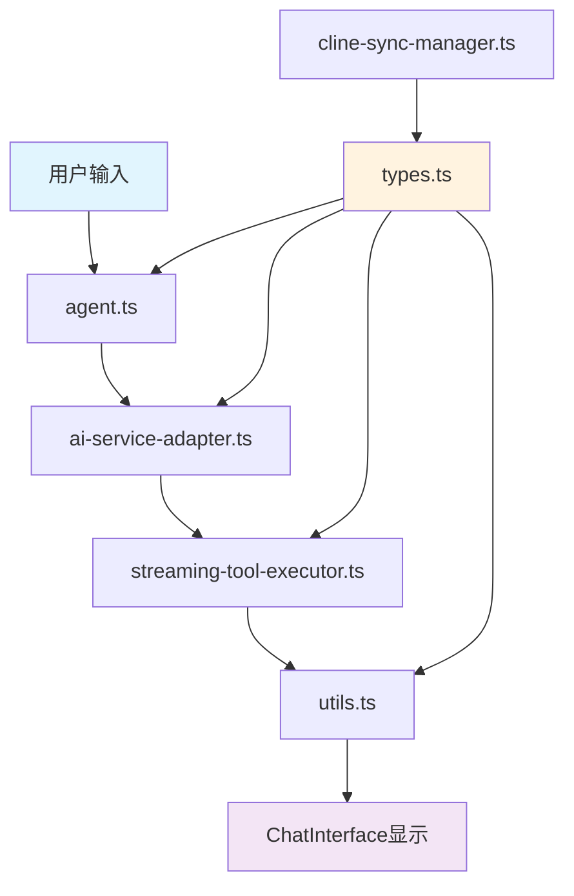

# Coding Agent 模块文档

## 📁 文件夹概述

`/lib/agents/coding` 是 HeysMe 项目中基于 Cline 架构设计的 AI 驱动代码生成系统。该模块实现了完整的代码生成、工具执行、流式处理和状态管理功能。

## 📋 文件清单

| 文件名 | 大小 | 行数 | 功能简述 |
|--------|------|------|----------|
| `types.ts` | 17KB | 636行 | 🎯 **统一类型定义** - 所有接口和类型 |
| `agent.ts` | 24KB | 744行 | 🤖 **核心代理** - 主要的AI代码生成逻辑 |
| `utils.ts` | 16KB | 650行 | 🔧 **工具函数** - 辅助函数和常量配置 |
| `streaming-tool-executor.ts` | 11KB | 390行 | 🌊 **流式工具执行器** - 实时工具调用处理 |
| `ai-service-adapter.ts` | 15KB | 518行 | 🔌 **AI服务适配器** - 连接外部AI服务 |
| `cline-sync-manager.ts` | 14KB | 485行 | 🔄 **Cline同步管理器** - 版本同步和更新 |
| `code_preview.md` | 3.9KB | 131行 | 📋 **流程分析文档** - 代码预览流程说明 |
| `index.ts` | 102B | 6行 | 📦 **模块导出** - 统一导出接口 |

---

## 🎯 核心文件详解

### 1. **types.ts** - 统一类型系统
```typescript
// 🎯 核心类型定义中心
- CodingAgentMessage          // 消息类型系统
- CodingAgentState           // 状态管理接口
- CodingAgentAsk/Say         // 交互类型定义
- CodeFile                   // 代码文件接口
- CodingAgentMessageFactory  // 消息工厂类
```

**功能特点:**
- ✅ 统一所有重复的类型定义
- ✅ 支持 Ask/Say 交互模式
- ✅ 完整的文件操作类型
- ✅ 流式处理状态管理
- ✅ 工具执行结果类型

### 2. **agent.ts** - 核心AI代理
```typescript
// 🤖 主要的CodingAgent实现
export class CodingAgent extends BaseAgent {
  async* process() // 流式AI代码生成
  handleStreamingAIGeneration() // 处理流式输出
  extractCodeBlocksFromText() // 代码块提取
  generateFallbackFiles() // 备用文件生成
}
```

**核心功能:**
- 🎯 **AI代码生成**: 调用Claude/OpenAI生成完整项目
- 🌊 **流式处理**: 实时显示代码生成过程
- 📁 **文件管理**: 创建、修改、组织代码文件
- 🔧 **错误处理**: 智能重试和降级方案
- 📋 **项目类型**: 支持简历、作品集、博客等多种项目

### 3. **utils.ts** - 工具函数库
```typescript
// 🔧 常量和工具函数集合
export const BASE_DEPENDENCIES    // 基础依赖包
export const STYLING_DEPENDENCIES // 样式依赖包
export const COLOR_SCHEMES        // 颜色主题配置

export function generatePackageJson() // 生成package.json
export function generateTailwindConfig() // 生成Tailwind配置
export function extractUserGoal() // 提取用户目标
```

**主要模块:**
- 📦 **依赖管理**: Next.js、React、TailwindCSS等预配置
- 🎨 **主题系统**: 5种内置颜色主题
- ⚙️ **配置生成**: 自动生成项目配置文件
- 🎯 **数据提取**: 从会话中提取用户意图

### 4. **streaming-tool-executor.ts** - 流式工具执行
```typescript
// 🌊 基于Cline架构的流式工具执行
export class StreamingToolExecutor {
  processStreamChunk() // 处理流式数据块
  executeActualTool() // 执行具体工具
}

export class StreamingToolParser {
  parseStreamingContent() // 解析工具调用标签
}
```

**核心特性:**
- 🔧 **实时工具调用**: write_to_file, read_file, execute_command
- 📝 **文本与工具分离**: 智能识别文本内容和工具调用
- ⚡ **异步执行**: 支持并发工具执行
- 🎯 **错误恢复**: 工具执行失败自动重试

### 5. **ai-service-adapter.ts** - AI服务适配器
```typescript
// 🔌 连接Coding Agent和AgentOrchestrator系统
export class CodingAgentAIServiceAdapter {
  sendMessage() // 发送消息到AI服务
  handleStreaming() // 处理流式响应
  mapResponseFormat() // 格式转换
}
```

**适配功能:**
- 🤖 **多AI服务**: 支持OpenAI、Claude、本地模型
- 🔄 **格式转换**: 统一不同AI服务的响应格式
- 🌊 **流式处理**: 实时处理AI流式输出
- ⚡ **性能优化**: 缓存和批处理优化

### 6. **cline-sync-manager.ts** - Cline同步管理
```typescript
// 🔄 用于同步Cline更新的管理器
export class ClineSyncManager {
  checkForUpdates() // 检查版本更新
  syncComponent() // 同步组件
  generateUpdateReport() // 生成更新报告
}
```

**同步功能:**
- 📥 **版本检测**: 自动检查Cline新版本
- 🔄 **组件同步**: 智能同步类型定义和组件
- 📋 **更新报告**: 生成详细的更新说明
- 🛡️ **备份恢复**: 同步前自动备份

### 7. **code_preview.md** - 流程分析文档
**内容概要:**
- 📋 完整的文件创建和预览流程分析
- 🔄 从AI生成到用户编辑的数据流转
- 🎨 FileTree、CodeEditor、WebContainer集成方式
- 🚀 用户体验优化策略

### 8. **index.ts** - 模块导出
```typescript
// 📦 统一模块导出
export { CodingAgent } from './agent';
export * from './utils';
```

---

## 🏗️ 架构设计

### 核心设计原则

1. **🎯 单一职责**: 每个文件都有明确的功能边界
2. **🔌 模块化**: 高内聚、低耦合的模块设计
3. **🌊 流式优先**: 支持实时、流式的用户体验
4. **🔧 工具导向**: 基于工具调用的AI交互模式
5. **🎨 类型安全**: 完整的TypeScript类型系统

### 数据流向



### 交互模式

```typescript
// 🎯 Ask/Say 交互模式
Ask: 'code_review' → 用户确认代码审查
Say: 'file_created' → AI通知文件已创建

// 🌊 流式工具执行
"正在生成代码..." → <write_to_file> → "文件创建完成"
```

---

## 🚀 使用方式

### 基本使用
```typescript
import { CodingAgent } from '@/lib/agents/coding';

// 创建Coding Agent实例
const agent = new CodingAgent();

// 流式处理用户请求
for await (const response of agent.process(userInput, sessionData)) {
  console.log(response);
}
```

### 集成到ChatInterface
```typescript
// ChatInterface会自动检测coding模式
if (sessionStatus?.currentStage === 'coding') {
  setIsCodingMode(true); // 自动启用Coding功能
}
```

---

## 🎯 核心特性

### ✅ 已实现功能

- 🤖 **AI代码生成**: Claude/OpenAI驱动的完整项目生成
- 🌊 **流式交互**: 实时显示代码生成过程
- 🔧 **工具执行**: write_to_file, read_file等工具调用
- 📁 **文件管理**: 创建、修改、预览代码文件
- 🎨 **主题系统**: 5种内置设计主题
- ⚡ **错误处理**: 智能重试和降级方案
- 🔄 **版本同步**: 与Cline官方版本保持同步

### 🎯 技术优势

1. **统一架构**: 基于Cline架构，专业级代码生成
2. **类型安全**: 完整的TypeScript类型系统
3. **流式体验**: 从生成到预览的无缝衔接
4. **模块化设计**: 易于维护和扩展
5. **智能适配**: 自动检测和切换模式

---

## 📚 相关文档

- [Cline官方文档](https://github.com/cline/cline)
- [ChatInterface集成说明](../../components/chat/README.md)
- [类型系统文档](./types.ts)
- [代码预览流程](./code_preview.md)

---

## 🔧 开发说明

### 环境要求
- Node.js 18+
- TypeScript 5.0+
- Next.js 15.0+

### 关键依赖
- `@webcontainer/api` - WebContainer集成
- `framer-motion` - 动画效果
- `monaco-editor` - 代码编辑器

### 调试模式
访问 `/test-coding-agent` 页面进行功能测试和调试。

---

*该模块是HeysMe AI驱动职业页面制作平台的核心组件，提供专业级的代码生成和编辑体验。* 🚀 