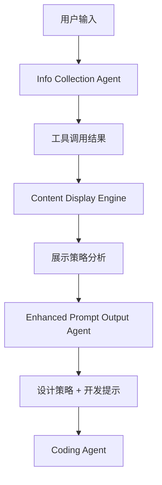

# 🔄 信息和展示策略传递给 Prompt Output Agent 指南

## 📋 概述

本指南说明如何将信息收集结果和内容展示策略传递给 `prompt-output` agent，实现智能化的页面设计和开发提示生成。

## 🏗️ 架构设计

### 数据流向


### Agent 间数据传递
```typescript
// 1. 信息收集阶段
InfoCollectionAgent → {
  user_info: any,
  tool_results: ToolResultData[],
  collection_summary: string
}

// 2. 内容分析阶段  
ContentDisplayEngine → {
  display_strategies: ContentDisplayStrategy[],
  content_analysis: ContentAnalysisResult
}

// 3. 设计生成阶段
EnhancedPromptOutputAgent → {
  design_strategy: EnhancedDesignStrategy,
  development_prompt: string
}
```

## 🔧 实现方案

### 方案1: 直接集成（推荐）

使用增强版的 `EnhancedPromptOutputAgent` 替换现有的 `PromptOutputAgent`：

```typescript
// lib/agents/agent-coordinator.ts
import { EnhancedPromptOutputAgent } from './prompt-output/enhanced-agent';
import { contentDisplayEngine } from '@/lib/services/content-display-engine';

export class AgentCoordinator {
  private promptOutputAgent = new EnhancedPromptOutputAgent();

  async processDesignRequest(sessionData: SessionData) {
    // 从 session 中获取信息收集结果
    const collectedData = sessionData.collectedData;
    const toolResults = sessionData.metadata?.toolResults || [];
    
    // 分析展示策略
    const displayStrategies = toolResults.map(result => 
      contentDisplayEngine.analyzeContent(result)
    );
    
    // 调用增强版 agent
    const input = {
      collected_data: collectedData,
      tool_results: toolResults,
      display_strategies: displayStrategies,
      user_goal: sessionData.userGoal,
      user_type: sessionData.userType
    };
    
    return this.promptOutputAgent.process(input, sessionData);
  }
}
```

### 方案2: 渐进式升级

在现有 `PromptOutputAgent` 基础上添加内容分析功能：

```typescript
// lib/agents/prompt-output/agent.ts (修改现有文件)
import { contentDisplayEngine } from '@/lib/services/content-display-engine';

export class PromptOutputAgent extends BaseAgent {
  // ... 现有代码 ...

  async* process(input: any, sessionData: SessionData, context?: Record<string, any>) {
    try {
      // 新增: 内容展示策略分析
      const toolResults = sessionData.metadata?.toolResults || [];
      const contentAnalysis = await this.analyzeContentDisplay(toolResults);
      
      // 原有逻辑，但传入分析结果
      const designStrategy = await this.generateDesignStrategyWithAI(
        userGoal, 
        userType, 
        collectedData, 
        sessionData.personalization,
        contentAnalysis // 新增参数
      );
      
      // ... 其余代码保持不变 ...
    } catch (error) {
      yield await this.handleError(error as Error, sessionData, context);
    }
  }

  // 新增方法
  private async analyzeContentDisplay(toolResults: any[]) {
    return toolResults.map(result => ({
      source: result.source_url,
      strategy: contentDisplayEngine.analyzeContent(result),
      confidence: this.calculateConfidence(result)
    }));
  }
}
```

## 📊 数据结构示例

### 输入数据格式
```typescript
const inputData: EnhancedPromptOutputInput = {
  // 基础信息
  collected_data: {
    user_info: {
      name: "John Doe",
      role: "Full Stack Developer",
      skills: ["React", "Node.js", "TypeScript"]
    },
    preferences: {
      style: "professional",
      colors: "blue_theme"
    }
  },
  
  // 工具解析结果
  tool_results: [
    {
      id: "github_1",
      tool_name: "analyze_github",
      source_url: "https://github.com/johndoe",
      extracted_data: {
        github: {
          username: "johndoe",
          repos: [...],
          stats: {...}
        }
      },
      // 展示策略分析结果
      display_strategy: {
        content_classification: {
          primary_type: "link",
          display_methods: [{
            method: "button_link",
            priority: "high",
            suitability_score: 0.9
          }]
        },
        accessibility_status: {
          is_accessible: true
        },
        embedding_capability: {
          can_embed: false
        }
      }
    }
  ],
  
  // 用户目标和类型
  user_goal: "create_portfolio",
  user_type: "developer"
};
```

### 输出数据格式
```typescript
const outputData = {
  // 增强的设计策略
  design_strategy: {
    layout: "portfolio_showcase",
    theme: "tech_blue",
    sections: [
      {
        id: "hero",
        title: "个人介绍",
        type: "hero",
        priority: "high",
        // 新增: 内容源和展示策略
        content_sources: ["user_info", "github_profile"],
        display_strategy: "direct_text_with_avatar"
      },
      {
        id: "projects",
        title: "项目展示", 
        type: "projects",
        priority: "high",
        content_sources: ["github_repos"],
        display_strategy: "card_grid_with_links"
      }
    ],
    // 新增: 内容集成策略
    contentIntegration: {
      displayMethods: [
        {
          content_type: "github_repos",
          method: "card_grid",
          responsive_behavior: "grid_to_list",
          fallback_plan: "simple_links"
        }
      ],
      restrictedContentHandling: [],
      interactionPatterns: [
        {
          pattern: "hover_preview",
          purpose: "quick_info",
          implementation: "tooltip_overlay"
        }
      ]
    }
  },
  
  // 增强的开发提示
  development_prompt: `
    创建一个现代化的开发者作品集，具体要求：
    
    ## 内容展示策略
    - GitHub仓库: 使用卡片网格展示，桌面端3列，移动端1列
    - 个人信息: 直接文本展示，包含头像和简介
    - 项目链接: 使用按钮样式，支持外部跳转
    
    ## 响应式设计
    - 桌面端: 丰富的交互和详细信息展示
    - 移动端: 简化布局，关键信息优先
    
    ## 技术实现
    - 使用 React + TypeScript
    - 支持暗色模式切换
    - 实现懒加载优化性能
  `
};
```

## 🚀 使用步骤

### 步骤1: 准备数据
```typescript
// 从信息收集阶段获取数据
const collectedData = sessionData.collectedData;
const toolResults = sessionData.metadata?.toolResults || [];

// 分析展示策略
const displayStrategies = toolResults.map(result => 
  contentDisplayEngine.analyzeContent(result)
);
```

### 步骤2: 调用增强版 Agent
```typescript
const enhancedAgent = new EnhancedPromptOutputAgent();

const input: EnhancedPromptOutputInput = {
  collected_data: collectedData,
  tool_results: toolResults,
  display_strategies: displayStrategies,
  user_goal: extractUserGoal(sessionData),
  user_type: extractUserType(sessionData)
};

// 流式处理
for await (const response of enhancedAgent.process(input, sessionData)) {
  if (response.system_state?.done) {
    const designStrategy = response.system_state.metadata?.designStrategy;
    const developmentPrompt = response.system_state.metadata?.developmentPrompt;
    
    // 传递给下一个 agent (coding agent)
    await codingAgent.process({
      design_strategy: designStrategy,
      development_prompt: developmentPrompt
    });
  }
}
```

### 步骤3: 处理结果
```typescript
// 更新会话数据
sessionData.metadata.designStrategy = designStrategy;
sessionData.metadata.contentDisplayAnalysis = contentAnalysis;
sessionData.metadata.readyForCoding = true;

// 通知用户
yield {
  immediate_display: {
    reply: "🎯 智能页面设计完成！已分析所有内容的最佳展示方式。",
    agent_name: "EnhancedPromptOutputAgent"
  },
  system_state: {
    intent: "advance",
    done: true,
    metadata: { designStrategy, contentAnalysis }
  }
};
```

## 🔧 配置选项

### 展示策略配置
```typescript
// lib/services/content-display-engine.ts
const displayConfig = {
  // GitHub 内容展示偏好
  github: {
    preferredDisplay: 'card_grid',
    maxRepos: 6,
    showStats: true
  },
  
  // 网页内容展示偏好  
  webpage: {
    preferredDisplay: 'embedded_preview',
    fallbackToScreenshot: true,
    maxPreviewHeight: '400px'
  },
  
  // 响应式断点
  breakpoints: {
    mobile: 480,
    tablet: 768,
    desktop: 1024
  }
};
```

### Agent 配置
```typescript
// lib/agents/prompt-output/enhanced-agent.ts
const agentConfig = {
  // AI 调用配置
  llm: {
    maxTokens: 32000,
    temperature: 0.7,
    model: 'claude-3-sonnet'
  },
  
  // 分析深度
  analysis: {
    enableContentAnalysis: true,
    enableDisplayStrategy: true,
    enableResponsiveOptimization: true
  },
  
  // 超时设置
  timeout: 30000
};
```

## 📝 最佳实践

### 1. 数据验证
```typescript
// 确保数据完整性
function validateInputData(input: EnhancedPromptOutputInput): boolean {
  return !!(
    input.collected_data &&
    input.tool_results &&
    input.user_goal &&
    input.user_type
  );
}
```

### 2. 错误处理
```typescript
try {
  const result = await enhancedAgent.process(input, sessionData);
  return result;
} catch (error) {
  console.error("Enhanced agent failed, falling back to basic agent:", error);
  return basicAgent.process(input, sessionData);
}
```

### 3. 性能优化
```typescript
// 并行处理展示策略分析
const displayAnalyses = await Promise.all(
  toolResults.map(result => 
    contentDisplayEngine.analyzeContent(result)
  )
);
```

## 🎯 总结

通过这个集成方案，您可以：

1. ✅ **智能分析内容**: 自动分析每个信息源的最佳展示方式
2. ✅ **响应式优化**: 为不同设备制定专门的展示策略  
3. ✅ **处理受限内容**: 智能处理不可访问的链接和内容
4. ✅ **个性化设计**: 基于用户类型和内容特点定制设计方案
5. ✅ **详细开发指导**: 生成包含具体实现细节的开发提示

这样的集成确保了从信息收集到最终代码生成的整个流程都是智能化和个性化的。
